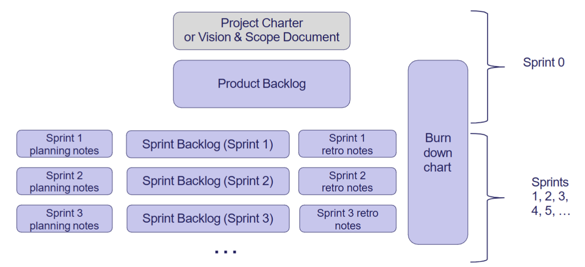
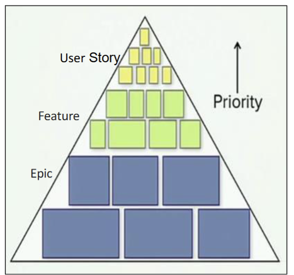
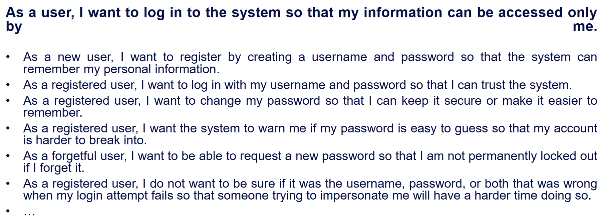
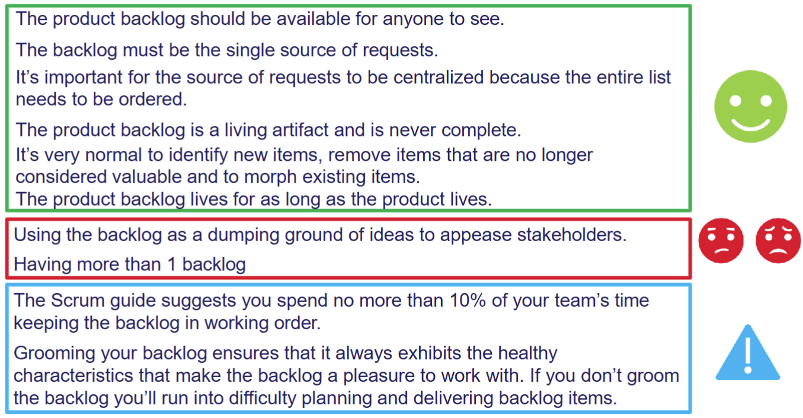
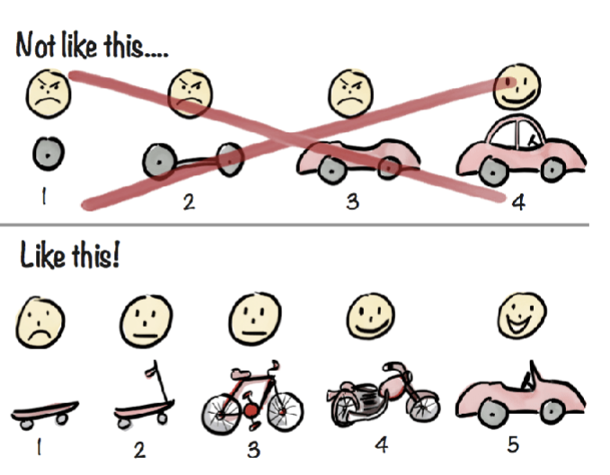
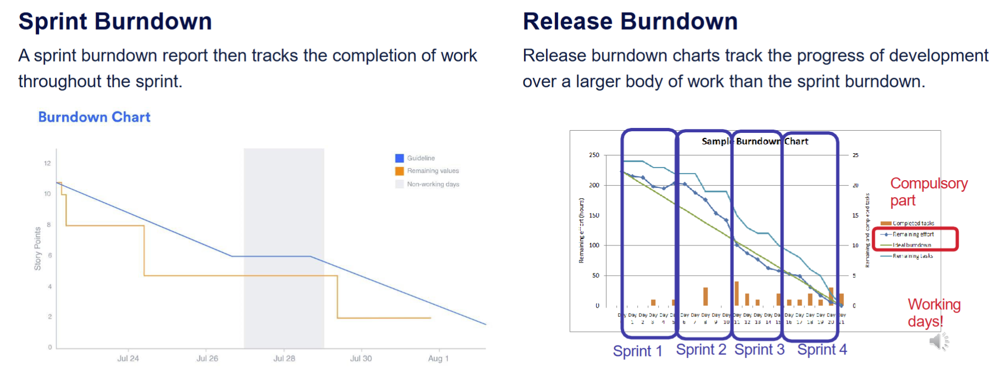

# Agile

## Scrum Artifacts

- Product Backlog
    - The Product Backlog represents the larger picture and lists epics and stories for a product.
    - Product goal is the commitment for product backlog
- Sprint Backlog
    - A Sprint Backlog is concerned with the stories and tasks that are to be undertaken within a sprint.
    - The items in sprint backlogs come from the product backlog during sprint planning.
    - Sprint Goal is the commitment for the sprint backlog
- Increment
    - The increment (or potentially shippable increment, PSI) is the sum of all the Product Backlog items completed during a sprint and all previous sprints.
    - The increment must be in a usable condition regardless of whether the Product Owner decides to release it.
    - At the end of a sprint, the increment must be done according to the Scrum Team's criteria called Definition of Done (DoD). i.e. DoD is the commitment for an Increment.

## Sprint Planning
- key Scrum ceremony
- the team selects and commits to user stories for the upcoming sprint
Preparation: Product Backlog Refinement/Grooming     - review for relevance, completeness, priority
1. Review the Product Backlog: The Product Owner presents prioritized user stories.
2. Define Sprint Goal: The team sets a clear, achievable objective.
3. Select User Stories: The team pulls stories from the backlog that align with the Sprint Goal.
4. Estimate Effort: The team assigns story points using the Fibonacci sequence (1, 2, 3, 5, 8, 13, etc.). Teams also use other popular estimation techniques such as T-Shirt Sizing, Planning Poker, or the Bucket System.
5. Break Down Stories into Tasks: Identify subtasks and assign responsibilities.
6. Finalize Sprint Backlog: The team commits to completing selected stories.

### MoSCoW

- Must have:
    - Requirements labelled as “MUST” have to be included in the delivered scope in order for it to be a success.
    - If even one “MUST” requirement is not included, the project delivery should be considered a failure.
- Should have:
    - “SHOULD” requirements are also critical to the project.
    - Will generally all need to be delivered for a successful project.
- Could have:
    - Requirements labelled as “COULD” are often seen as nice to have.
- Won’t have:
    - “WON’T” requirements are either the least-critical, lowest-payback items, or not appropriate at this time.

### Scope
- Scrum will typically have 2-4 week sprints. Scope is planned accordingly.
- What if the team finishes early? Options include:
    - Additional work on planned scope (testing, review, ...) if of value
    - Pull in additional user stories if they fit
    - Refactoring (improve non-functional characteristics) if planned and fits
    - Do work outside the sprint (preparation for later sprint, prototyping, ...)
- What if the team can’t finish everything in the plan?
    - Reduce planned work (testing, review, ...) if still meets DoD and QA permits
    - Push one or more user stories out of sprint scope (may be able to split a story on the fly)
- What if there are changes to user stories in the planned print scope during the sprint?
    - Reduced scope     - see finishes early for options.
    - Increased scope     - must reduce plan to its original size (options: see can’t finish everything)

### Requirements 
- Requirements are what determine whether your software is
    - complete
    - Correct
- Because requirements tell you what behaviour is considered correct, they’re hugely important to testing
    - every requirement should be tested
    - each test should be able to be traced back to corresponding requirements

### Getting requirements 
    - In Waterfall models, requirements are elicited once, at the start of the project, usually by a team of business analysts.
    - Agile processes place more emphasis on a continuing relationship with the client or their representative, but there still needs to be a requirements brainstorming session during project inception
- Requirements in traditional system
    - Traditional models: text-based
    - all of the requirements must be written down
    - the written description must contain all the information necessary to begin to design and implement
    - typically completed before design begins

- Requirements in Agile
    - Idea: can be very hard to nail down a complete set of requirements in advance, so don’t try to do that
    - Instead, get the Product Owner involved in development
    - get something up and running as quickly as possible
    - get Product Owner to pick which features to add next, based on client priorities
    - try to add as much value as possible per iteration
    - repeat for each sprint
    - Can’t avoid doing some requirements management during inception     - otherwise you won’t have anything to do during your first iteration

### User Stories
- SHORT DESCRIPTIONS OF A FEATURE EXPLAINED FROM THE PRESPECTIVE OF THE PERSON WHO DESIRES THE FUNTIONALITY, USUALLY A USER OF THE PRODUCT
- 3 Steps Process also called 3 C’s
    - Card
    - Conversation
    - Confirmation
- As a [user role],
I want to [goal action],
So that [reason/benefit]

- (Sprint) User Story
    - Detailed technical level
    - A developer’s perspective
    - A conversation placeholder
- Feature User Story
    - Product capabilities
    - Business level detail
    - Product Owner perspective
- Epic User Story
    - Lacks detail
    - New business services
    - A product

#### User Story Characteristic
- INVEST 
    - Negotiable
        - Are **not a contract**, not detailed specifications.
        - Are a kind of “notes” to remind the team on to discuss and collaborate to clarify the details near the time of development
        - High level, no details, as the goal is
        - To avoid a false impressions of precision or completeness
        - To highlight that further discussions are a part of the process
    - Independent
        - Should be as independent as possible
        - Dependencies might lead to difficulties with prioritizing and planning
    - Valuable 
        - Should be **valuable** to the user (or owner) of the product – like traditional req. specification should contain only necessary requirements
    - Estimable
        - Need to provide enough information to **estimate**, without being too detailed.
    - Small
        - Should be “**small enough**”: small in the sense of the feature scope, not in the sense “very short text”
        - Should be detailed enough for the team to start work from, and further details can be established and clarified at the time of development.
        - Generally: A team must be able to finish a user story **within** the sprint in which it starts
    - Testable
        - Should provide enough details of how the User Story will be **tested**.
- Deliberately leave out a lot of important details: Help getting the high-level picture of requirements (provide a “bone” for eliciting during scrum meetings)
- Product Backlog is evolving during the whole length of the project.
- Elaborated and modified through the project based on user input
- Centered on the result and the benefit of the thing you're describing
- User- and usage-centric requirements elicitation: Focus on what the user wants to do, and not what the user wants the system to do:
- By focusing on the user’s goal and vision, you can ensure that the users get the functionality that they require

### User Role 
- Broaden the scope from looking at one user
- Allows users to vary by
    - What they use the software for
    - How they use the software
    - Background
    - Familiarity with the software / computers
- Definition:
    - A user role is a collection of defining attributes that characterize a population of users and their intended interactions with the system

### Epics
A large user story is typically referred to as an epic
There is no “magic size” at which we start calling a user story an epic
Generally: an epic is a user story that will take more than one or two sprints to develop and test
Epics are split into smaller user stories, so that a story can be completed within a sprint.

### Conditions of Satisfaction
- a high-level acceptance test (acceptance criteria) that will be true after the user story is complete

### Product Backlog
- Requirements for a system, expressed as a prioritized list
- Each item should have value to the users/customers
- Is managed and owned by a Product Owner
- Spreadsheet, Trello board, etc.

## Increment 
- The product increment (or potentially shippable increment, PSI) is the sum of all the Product Backlog items completed during a sprint and all previous sprints.
The increment must be in a usable condition regardless of whether the Product Owner decides to actually release it.
At the end of a sprint, the increment must be done according to the Team’s Criteria called Definition of Done (DoD)

### Definition of Done
- The exit-criteria to determine whether a product backlog item is complete.
- In many cases the DoD requires that all regression tests should be successful.
- The definition of "done" may vary from one Scrum team to another but must be consistent within one team.
- List of activities that add verifiable/demonstrable value to the product
- DoD is orthogonal to user acceptance criteria (functional acceptance) for a feature: It is a comprehensive checklist of necessary, value-added activities that assert the quality of a feature and not the functionality of that feature.
- Ensures that only truly done features are delivered, not only in terms of functionality but in terms of quality as well.
- Goals:
    - to build a common understanding within the Team about Quality and Completeness
    - to be a checklist that User Stories (or PBIs) are checked against
    - to ensure the increment shipped at the end of the Sprint has high quality and that the quality is well understood by all involved.

#### Example of DoD
- Every new feature is tested during the sprint.
- Testers & developers work closely together. Testing is done by the whole team.
- Every sprint has its own User Acceptance testing phase (Sprint Review).
- A small piece of working software is delivered to the client at the end of the sprint.
- Client does User Acceptance test.

### DoD vs AC
- DoD Levels 
    - DoD for a Product Backlog Item (e.g., writing code, tests and all necessary documentation)
    - DoD for a Sprint (e.g., install demo system for review)
    - DoD for a Release (e.g., writing release notes)

## Agile Effort Estimation
- Story Points
    - a story point is a relative measure of the size of a user story (recall that the requirements of the system are documented using user stories)
- Velocity
    - velocity is a measure of productivity of team, which is represented by the number of story points delivered in a specified time period

### Story Point
- Traditional software teams give estimates in a time format: days, weeks, months.
- Many agile teams, however, have transitioned to story points.
- Story points rate the relative effort of work
    - Relative to completed user stories
    - Relative to other stories currently being estimated
- Story points drawn from abstract scales (no units)
    - Fibonacci: 0, 1, 2, 3, 5, 8, 13, 21, 34, 55, 89
    - or modified Fibonacci: 0, ½, 1, 2, 3, 5, 8, 13, 20, 40, 100
    - or powers of 2: 0, 1, 2, 4, 8, 16
    - or T-shirt sizes: XS, S, M, L, XL, XXL

- We are better at relative estimation; with time out of the picture, we are free to concentrate on comparing user stories rather than trying to guess their absolute size accurately.
- Times don’t account for the non-project related work that inevitably creeps into our days: emails, meetings, etc.
- Each team will estimate work on a slightly different scale, which means their velocity (measured in points) will naturally be different. This, in turn, makes it harder to play politics using velocity as a weapon.
- The relative size of story points provides some information to the product owner to assess the business value against the level of the effort.

### Velocity 
- is the rate at which a team can complete story points within a sprint
- Working at a sustainable pace is one of the Agile principles.
- We need an understanding of the number of story points we can complete in a Sprint at a sustainable pace.
- For the first few sprints, expected velocity is a matter of guesswork
    - not sure about estimation yet
    - might have issues at the start of development which settle down through successive sprints
- After a while, the team move closer to a steady pace of development
- Velocity will be disrupted due changes to team membership, the development approach being undertaken, the kind of system being developed and so on.
- A stable situation supports a stable velocity and accurate story point estimation.

### Estimation Process 
1. Develop user stories for the system.
2. Estimate the number of story points for each story (discussed later).
3. Use the team’s velocity (points per sprint or week) from previous experience to estimate the delivery time of a defined scope
4. During development, measure the actual velocity of the team.
5. Using this velocity, re-estimate the time it will take to deliver the scope.

- Estimate by analogy
    - There are no units for story points, always base our measures on other stories. If story A is about the same size as story B, they should have the same number of story points.
- Decompose a story
    - By decomposing a story into the tasks that are required to complete the story, we can find measures that we know about the tasks and combine them to provide a total measure.
- Use the right units
    - The relative units should not be too fine grained.  A pattern-based scale is used. For example, measures can only be 1, 2, 4, 8, or 12 or numbers in the Fibonacci sequence.
- Use group-based estimations
    - For a story that is to be implemented by a team, the whole team should provide estimates. Techniques such as the Delphi method or its adaptations can be used to reach consensus.

- Issues
    - Analysis Paralysis:
        - Spending too much time attempting to develop detailed estimates.
        - Delaying making commitments until all of the information required to make decision has high level of certainty.
    - Cavalier approach:
        - Not worrying about managing uncertainty and risk at all and just starting the project with no planning at all.
        - Assuming that whatever uncertainty and risk is inherent in the project will be discovered and somehow work itself out as the project succeeds.

### Estimation Technique
- Fibonacci
- Planning Poker
    - use poker cards to vote and iterate until reach final decision
- T-shirt size
    - use XXS,XS,S.... then convert to numeric

#### Computing Velocity 
$V = \frac{SI}{T_i}$

#### Estimated Delivery Time

$T = \frac{\sum_{i=1}^{n} SP_i}{V}$

### Burndown Charts
- Burn-down chart is used to track work completed against time.
- The x-axis is the time frame, and the y-axis is the amount of remaining work left that is labelled as story points. (y-axis could be based on person-hours).
- The chart begins with greatest amount of remaining work, which decreases during the project and slowly burns to nothing

#### Sprint Burndown vs Release Burndown 

### Warning
- Be very careful using story points to measure developers’ performance:
- if team members end up competing, they will rush their code
- rushed code is buggy code
- working at an unsustainable pace causes burnout, which destroys team morale and makes their code worse

## Planning 
- Agile projects approach typically defers planning decisions to “the last responsible moment”

    - You typically start with a high-level plan that is sufficient for defining at least the vision, scope, and objectives.
    - The details of the plan and the requirements are further
    elaborated as the project progresses – to the level of detail is needed at that point to support whatever level of planning and estimation is required for the project
    - By the last responsible moment, we mean the latest point in time that a decision can be made without impacting the outcome of the overall project.

### Planning Strategy
It is necessary to provide key milestones and assumptions
as they will help stakeholders see why you are using **Rolling Wave Planning** and what to expect as the project progresses.

- Progressive Elaboration
    - Planning too far in advance == some amount of speculation
    -Quite often, that speculation is wrong and will result in wasted effort in replanning later, might also require reworking any work that has been done based on erroneous assumptions.
    - Planning requirements [too far in advance] should not stop you from progressing with the implementation works in the project.
    - Requirements should only be defined to the extent needed to support whatever decisions or action is required at that particular point in time.

### Developing requirements in Agile
- simplicity and 
- limiting a solution to what is “just barely good enough”
- Exist a optimum point and additional features beyond the point diminish the value
- close collaboration with the stakeholders
- It is good 
    - to start with the simplest and most basic solution possible
    - then add to it incrementally and iteratively only to the extent that it adds value to the user.

### Release Level 
- release is set of product increments that is released to the customer.
- happens when project is bigger with multiple releases.
- While In small projects:
    - the product backlog alone can provide enough project overview;
    - the size, duration and deliverables are easily recognised, and there is no need to synchronise or group deliverables or teams.
### Characteristics of a Release
- Releases are defined by date, theme, and planned feature set
- Releases are defined at the system or program level by the Product Owner
- Scope is the variable
- Date and quality are not variable, which highlights the need to use a prioritised product backlog as the basis of a planning event
- All teams must commit to the same rhythm of iterations. When all teams work to the same rhythm, the discovery and management of dependencies occurs automatically during the planning activities
- There are fixed release dates across all teams of the program with a typical interval of two to four months.
- A release can stretch over six to nine months, although two to four months is more common.

### Plan Regressively 
1. Vision & Scope document
2. Product Backlog: Specify the PBIs (Product Backlog Items) on the basis of the features
    - PBIs are about the what
    - PBIs represent business value (ideally, from the customers’ perspective)
    - PBI == user story / epic
    - User story should be small enough to be completed within a sprint
3. Sprint Backlog: Specify tasks on the basis of PBIs.
    - Sprint tasks are about the how
    - A task is a step by the team to create the business value (represented by PBI)
    - A task should be small – no bigger that 1 day of work
    - Some teams prefer to specify small enough PBIs, so that tasks are not even necessary

#### Analysis Agile Planning
- Common Pitfalls
    - Poor estimation and Overcommitting -> commit to all three user stories without considering their actual capacity and velocity from previous sprints
    - Lack of Clarity – Project Release Planning and Sprint Allocation -> fail to explain their overall release plan and how they managed the product backlog
    - Lack of Continuous Testing -> solely on development during the first two sprints, leaving testing to the final sprint -> Bugs are discovered late
    - Lack of Clarity on Testing Procedures -> "We did some testing in the last sprint," -> is not enough to explain -> to solve : should outline their testing strategy, explaining how testing was integrated into each sprint and what tools or methods were used.
    - Inadequate Sprint Planning
    - Last Minute Technology Decisions
    - Unclear Roles and Responsibilities
- Effective Agile Planning
    - Realistic Estimation and Commitment
    - Continuous Testing -> Issues are caught ealier 
    - Thorough Sprint Planning
    - Early Technology Decisions
    - Clear Roles and Responsibilities