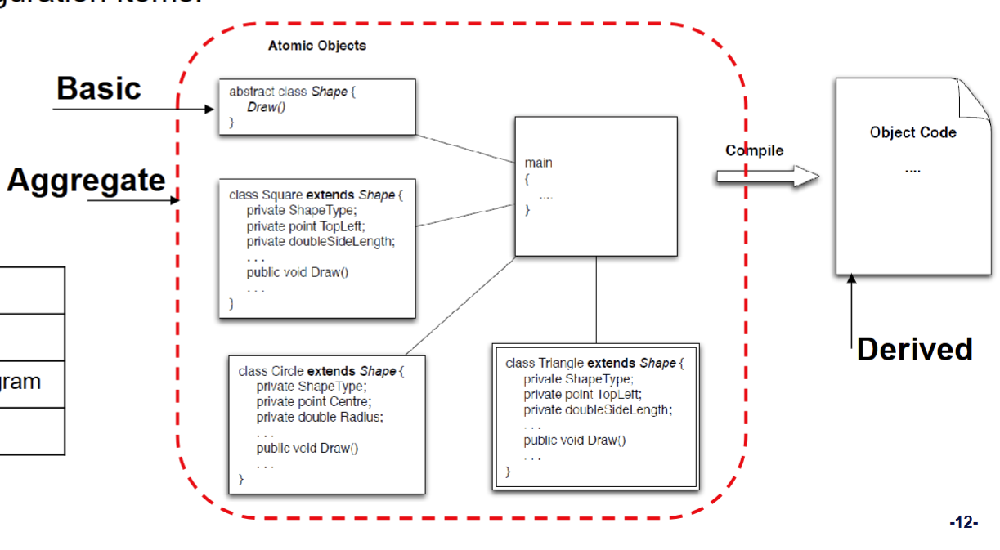
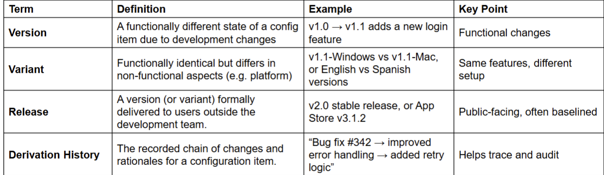

# Configuration Management
- The process of managing changes to a software system and maintaining the integrity and traceability
of the configuration throughout the system lifecycle.

## Why it matters
- Software System are fragile
    - Software projects produce hundreds of interrelated artifacts:
        - Code, requirements, diagrams, tests, documentation
    - A change to one can break many others
    - Without coordination, these systems become inconsistent, unstable, or even unusable

- What can go wrong
    - Conflicting versions cause test failures
    - Untracked changes lead to bugs in production
    - Teams overwrite each other’s work
    - Inconsistent documentation causes delivery delays

### Role of Configuration Management
- Tracking versions
- Managing dependencies
- Reverting changes safely
- Auditing what changed and why

#### Case Study
- Coles POS Outage (2020)
    - What Happened?
        - On Friday, March 20, 2020, Coles supermarkets across Australia experienced a nationwide payment system failure.
        - Customers were unable to pay for groceries for approximately 4 hours.
        - All stores were forced to close, affecting operations in every state and territory.
        - Coles later reported that the issue was due to a software update to their Point of Sale (POS)
    system.
    - Why does it matter?
        - Even a short outage caused by poor configuration management can lead to massive financial loss, reputational damage, and customer frustration.
    - Root Cause Analysis
        - A configuration change (update to software or related services) was deployed without:
            - Full regression testing across environments
            - Clear rollback documentation
            - Effective coordination with other dependent systems (e.g., payment gateways)
        - The update led to system-wide incompatibility, breaking the POS terminal functions
    - Recovery Enabled by Configuration Management
        - Fortunately, CM practices were in place:
            - The previous stable version was still stored and versioned
            - The update process was traceable, and dependencies were known
            - Staff could roll back to the earlier baseline version
        - After 4 hours, systems were restored and stores reopened

### Goal
- Goal is to manage change as 
    - change on an artefact may affect dependencies of others
    - may leave the configuration in an inconsistent state
    - Assume change in requirement -> change in The test plan, test cases and testing scripts for the code and code modules

### Software Configuration

- The total of all the artefacts
- Their current state
- The dependencies between them

## Core Activity

### Identification Types of Configuration item
- There are three different types
    1. Basic
    2. Aggregate
    3. Derived

- Example items
    - Requirements: Software Requirements Specification, individual requirements, use-cases
    - Design UML diagrams, class designs
    - Code: Source code, compiled binaries
    - Testing: Test plans, scripts, drivers
    - Documentation: User manuals, internal wikis

### Version Control
- Version control is the process of managing and tracking changes to configuration items
over time
- Supports
    - Track change history: Know what changed, when, and by whom
    - Rollback capability: Safely revert to a previous working version
    - Support collaboration: Prevent developers overwriting each other’s work
    - Enable reproducibility: Build or test any historical version
    - Release management: Tag and baseline known-good versions

### Verison vs. Variant vs. Release

#### Change Control: Managing Changes Across the System
- Change control is manual step in software lifecycle. It combines human procedures and automated tools.
- Change request submitted and evaluated to assess technical merit, potential side effects, overall impact on other configuration object and system function, and project cost of change
- Process

### Change Management Plan: Coordinating Large-Scale Change
- Change Management Plan
    - A part of an overall configuration management plan to specifically control these changes to the configuration
    - Changes must be made in a way that allows everyone on the project team to find out:
        - exactly what changes need to be made
        - what they need to do to affect the change
        - why the change is being made
        - how it will impact them
- Baseline
   - A baseline is an artefact that is stable.
   - It has been formally reviewed and agreed upon, that is now ready for future development.
   - It can only be changed through a formal change management procedure.

### Configuration Auditing
- Ensuring Consistency and Integrity
    - Assuring that what is in the repository is actually consistent.
    - That all of the changes have been made properly

### Status Reporting
- Tracking the state of configuration
- Status reporting provides visibility into the state of configuration items and helps teams detect inconsistencies,
omissions, or delays

- Why it matters
   - Detect missing or outdated artifacts
   - Identify configuration drift early
   - Align development and CM progress
   - Enable informed decision-making