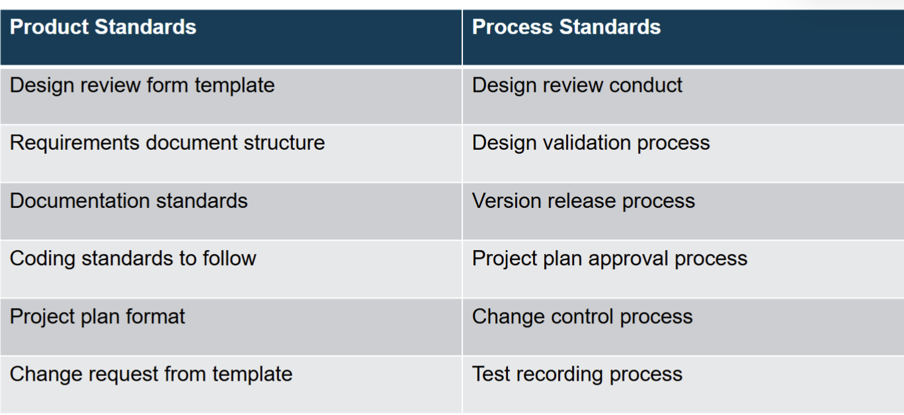
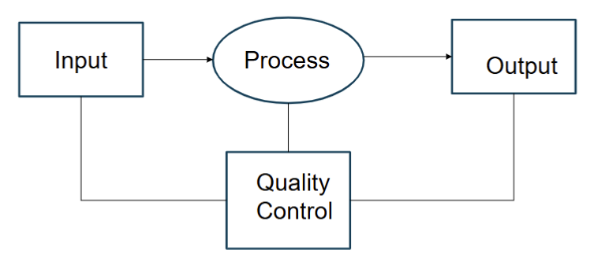
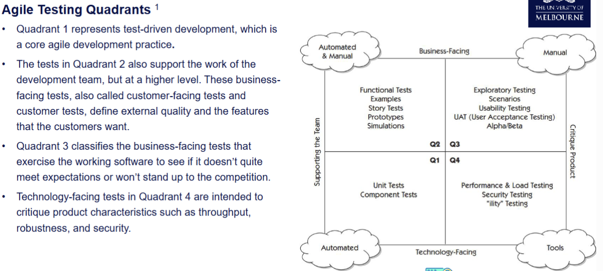
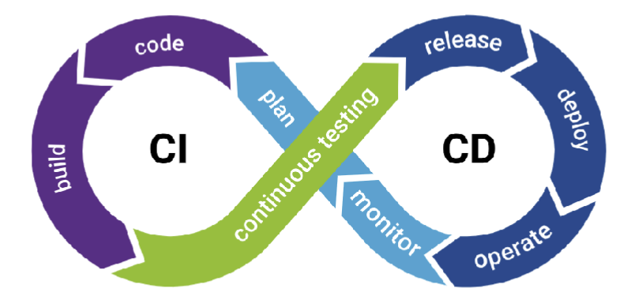
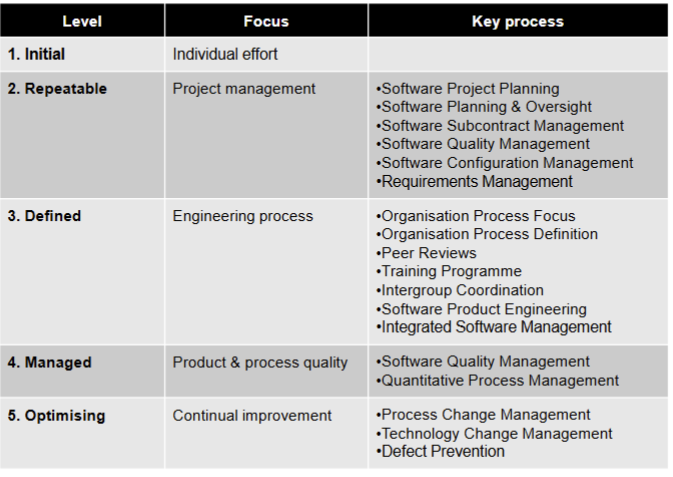
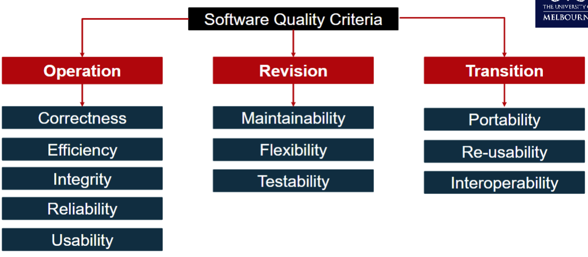

# Software Quality Management

- Evidence shows that we cannot simply fix up our software post-hoc and add in quality attributes after building the system.
- Quality must be built into the software from the beginning.

## What is Software Quality

- End-User Perspective
    - users judge the quality by interaction, program is reliable, reasonable performance, easy to use, etc.
    - external quality characteristic

- Developer Perspective
    - number of faults, easily modifying, testing, understanding system design
    - internal quality characteristic

### Cost of Software Quality Management
- $cost = cost_{conformance} + cost_{nonconformance}$

- Conformance 
    - Deliver product meet requirements and are fit for purpose
    - e.g. the development of quality management plan, cost of analysing and managing product requirements, cost for testing.
- NonConformance
    - Taking responsibility for failures or not meeting quality expectations

- Quality Management adds additional cost, consume resources such as time, money, human.
    - Trade off when implementing Quality Management between Conformance and NonConformance. 
    - Balancing **cost** of implementing software quality processes to follow (conformance), and **risk** of having to fix problems if they are identified further into the project (nonconformance).
        - The total cost of getting the software right is higher the later into the project issues are detected

- Cost is **High**
    - cost can be extremely harm:
        - Bug in missle launch system kills thousands
        - Bug in Radiation treat kills patient by overdose
    - not juts in money
        - error found in development phase may take 4.9 hours
        - same error after releasing could take 15.3 hours

### Conformance : Cost vs Stage
- Consider an issue detected in a system under development
- The total project effort in direct relation to that issue will be greater than if the system was developed without that issue. 
    - There was effort involved so that getting the issue
        - The later in project, the higher the effort
    - Effort around the resolution process: change approval
    - Effort solving the issue
        - Minor: change color of displayed item
        - Significant: system workflow need rebuilt
        - Project Stopper: current architecture throughput can't handle transactions fast enough
- The view of cost is assuming the issue being resolved
- Cost will be different if we don't bother fixing it

## Quality Management Process
- Performing Quality Assurance
    - Periodically evaluating overall project performance to ensure the project will satisfy the relevant quality standards.
- Planning Quality
    - Incorporating quality standards into project design
    - Identifying which quality standards are relevant to the project and how to satisfy those standards.
- Performing Quality Control
    - Monitoring specific project results to ensure that they comply with the relevant quality standards, while identifying ways to improve overall quality.

### Performing Quality Assurance
- Define or select **Quality Standards**
    - a standard can be simply as **set of rules for ensuring quality**
    - standard is important in quality managment porcess
- Two type of standard
    - Product Standard
        - apply to the product being developed -> how the product look like
    - Process Standard
        - define the process to follow during development -> writing document xd

#### Verification & Validation
- Verification  -> following the correct development procedure
    - attempt to ensure that the product is built correctly, the output products of an activity meet the specifications imposed on them in previous activities.
    - normally involves two (sets of) artifacts: req. spec. vs design, design vs code; this is an internal developer activity
    - ensuring you are **building the system right** (the right way)
- Validation -> build the correct product
    - ensure that the right product is built—that is, the product fulfils it specific intended purpose
    - going back to the stakeholders to check if the product meets their requirements, this normally involves something/someone external
    - ensuring that you are **building the right system** (to meet stakeholder needs)
#### Types of Testing
- a form of verification
- Unit Test
   - Used to test each individual component (often a program) to ensure it is defect-free.
   - Performed before commencing integration testing.
- Integration Testing
   - Occurs between unit testing and system testing.
   - Ensures that subset(s) of the overall system work together correctly.
- System Testing
   - Tests the entire system as one entity. Ensures that the entire system is working correctly.
- User Acceptance Testing
   - Testing performed by end users prior to accepting the delivered system. Ensures that the system fits the needs of users of the system.

### Quality Planning
- Incorporating quality standards into project design
    - Identify which quality standards are relevant to the project and how to satisfy them
- Outcome of the process is Software Quality Plan (SQP), or Software Quality Assurance Plan (SQAP)

#### SQP template
Software Quality Assurance Plan
- Product Overview
   - A description of the product, intended market, and quality expectations.
- Product Plan
   - The critical release dates and responsibilities    - could point to the schedule.
- Quality Goals
   - The quality goals and plans for the product, including identification and justification of critical product quality attributes.
- Process Description
   - The quality assurance processes that should be used for product development and management (reviews, audits etc).
- Document and Coding Standards
   - Standards for the documents and coding standards.
- Risks and Risk Management
   - The key risks that might affect product quality and the actions to address these risks (could provide a link to appropriate risks in the Risk Management Plan).

### Quality Control and Monitoring
- Involves monitoring the software development process to ensure that the quality assurance procedures and standards specified in the Software Quality Plan are being followed 

- Reviews 
    - common project management technique for monitoring and control of trageted project aspects or artefacts
1. Technical Review
   - common technique used for verification and validation (details to follow)
2. Business Review
   - assess the project's progress, performance, and outcomes to date to ensure alignment with project goals and stakeholder expectations.
3. Management Review
   - review actual progress - scope, schedule, budget, and resourcing    - against a baseline plan.

#### Techinical Review
- Artefacts produced during the development process are reviewed as a way of identifying problems and addressing them earlier in the project
- By **peer reivew** in the dev team with **authors included** 
- Aim to uncover problems in an artefact and seeking ways to improve
- a **soft** method for QA -> nothing is executed

- Pros
1. Can be performed on any software artefact, whereas many “hard” methods of quality assurance, such as testing and measurement, can be performed only on executable artefacts.
2. Earlier detection of problems in software artefacts leads to lower costs of resolution.
3. Studies show that roughly 30-70% of all programming faults found in a project were located using source code reviews, and up to 80% according to studies performed by IBM. Some studies demonstrated that review techniques found several types of faults that testing failed to find, and vice-versa.
4. Reviews find the actual faults in source code, in contrast to testing, which merely indicates that there is a fault somewhere in the program. After a fault is detected with testing, it must then be located.
5. Due to internal pressure of getting software releases out the door, programmers make more mistakes when correcting faults that were found during testing than they do correcting faults during the review phase.
- Cons
1. Can be time and resource consuming.
2. Should be carefully planned and executed to get the desired outcomes.
- Types
1. Informal Reviews
2. Formal Reviews
    Including:
    1. Walkthroughs
    2. Code Inspections/Code Review
    3. Audits

- Informal Reviews
   - A simple desk check or casual meeting with a colleague which aims to improve the quality of a document.
   - No formal guidelines or procedures that are followed.
   - The effectiveness of informal reviews is considerably less than formal reviews, because of the lack of diversity found in a group.
   - Checklists are tools that can help to improve the effectiveness of a review.
   - A checklist is a list of questions that the reviewer must answer about an artefact, however, the
questions are generic questions about that type of artefact.
   - Less time and resource consuming than a formal review.

- Formal Review (general):
- A meeting with multiple stakeholders such as developers, testers, client.
   - The group approach has benefits of bringing out different perspectives.
- Meeting should adhere to the following constraints.
   - The review team should be 3-5 members carefully chosen.
   - The meeting should last no longer than 90 minutes.
   - Following are the critical roles.
        - Review Leader: responsible for organizing the review.
        - Author: at least one author should be present.
        - Reviewers: at least two or three non-author stakeholders
        - Recorder: responsible for recording all important review comments
        - The review meeting could recommend one of the following:
   - Accept without further changes.
   - Accept with proposed changes.
   - Reject the artefact    - this requires a re-review after modifications

- Walkthrough
- coule be for code, a design or a document
- a review process where author leads a group of reviewers by walking them through the artefact under review
- Difference with a general formal review
    - Moderator, that leads the review is the author of the artefacts being reviewed
    - Reviewers do not need preparation
    - WHen defects or in consistent are found, possible solutions are discussed

- Inspection
- Inspection could be for code, or a design, or a document
- An inspection checklist for the relevant kind of artefact is used.
- Following are the main differences from a general formal review:
    - Reviewers need to have examined the artefact against the checklist.
    - Minor defects will be collated to be addressed outside of the review meeting
    - More substantial defects, and possible solutions, are discussed.
- Code Inspection:
- This form of inspection is conducted on a code artefact using a checklist based on the coding standard.

- Audit 
- Reviews a specified process or product to determine if it conforms to the defined standards.
- It is a type of technical review where the authors of the artefact being audited are not involved in the audit process at all.
- Audits can focus on a subset of examples as an indicator of the broader set; this subset could be selected randomly or with a particular focus.
- Audits can be performed by a team that is completely external to an organisation
- Procuct Audits: confirm product meets standards
- Process AUdits: ensure team follows process

## Agile Centric Software Quality Management

### Agile QA mindset
1. Provide Continuous Feedback
    - Fosters a culture of open communication and improvement.
2. Deliver Value to the Customer
    - Agile QA prioritizes ensuring software not only meets technical requirements but also delivers real value to the customer, aligning tests and quality goals with customer needs.
3. Enable Face-to-Face Communication
    - Programmers should be able to talk to others including programmers and business experts easily.
4. Have Courage
    - Courage to raise concerns, suggest improvements, and advocate for quality.
5. Keep It Simple
    - Simplifying processes, tests, and code leads to more efficient and effective QA practices.
6. Practice Continuous Improvement
    - Constantly evaluating and improving testing processes, tools, and techniques. Helps teams adapt and maintain high-quality standards.
7. Respond to Change
    - The ability to quickly adapt testing strategies in response to changing requirements or feedback.
8. Self-Organize
    - Agile QA teams are often self-organizing, with members taking initiative and making decisions collaboratively to achieve quality objectives.
9. Focus on People
    - Agile QA emphasizes people over processes and tools, fostering a supportive and productive environment.
10. Enjoy
    - Enjoyment and passion for the work can significantly improve team morale, creativity, and productivity.

### Principle of Agile QA
1. Testing early and often with an emphasis on the usefulness of "Shift Left" approach.
    - “Shift-Left” refers to moving testing activities earlier into the development process, so that software quality is improved
2. Importance of automation.
3. Open feedback and communication channels

### Agile QA Methodologies
- Test Driven Development (TDD)
- Acceptance Test-Driven Development (ATDD)
- Behavior-Driven Development (BDD)

#### Test Driven Development QA Practices
- a software development approach.
- It dictates that developers should first write unit tests for a new feature before writing the actual code to implement that feature.
Three Laws of Test-Driven Development (Robert Martin)
1. You are not allowed to write any production code unless it is to make a failing unit test pass.
2. You are not allowed to write any more of a unit test than is sufficient to fail; and compilation
failures are failures.
3. You are not allowed to write any more production code than is sufficient to pass the one failing unit test.

- TDD Process
1. **Write a Test**. Define a test case to validate the login functionality. For example:
    - 1: Verify that a user with correct credentials can login successfully.
    - 2: Verify that a user with incorrect credentials receives an appropriate error message.
2. **Write the Code**: Implement (only) the login form and backend logic to handle user authentication
based on the defined test case.
3. **Run the Test**: Execute the test to ensure that users can login successfully with valid credentials and receive error messages for invalid ones
4. **Refactor**: Review the code to improve its structure, readability, and efficiency without changing its behavior in relation to the test:
    - Optimizing the authentication process
    - Enhancing handling to provide clearer feedback to users

#### Acceptance-Test Driven Development QA Practices
- a software development approach.
- Stakeholders are first engaged to collaboratively discusses acceptance criteria, with stakeholders and team members providing input on what to test before any code is written.
- Tests are then written to evaluate these specifications, and only then writing the actual code to implement that feature.

ATDD Cycle - Example: Login Feature
1. **Write Acceptance Criteria**: Specify acceptance criteria for the login feature focusing on the behavior and functionality expected by stakeholders, such as:
    1. Users should be able to log in with valid credentials
    2. Users should receive an error message for invalid credentials
    3. The system should prevent brute force attacks by limiting login attempts.
2. **Write Acceptance Tests**: Develop automated acceptance tests based on (a) to (c) as executable specifications for the desired behavior of the login feature.
    - Test 1: Verify that a user with correct credentials can log in successfully.
    - Test 2: Verify that a user with incorrect credentials receives an appropriate error message and that a subsequent correct login is successful
    - Test 3: Verify that a sequence of unsuccessful attempts exceeding the system limit results in a delay of the preset time before another attempt is permitted
3. **Implement Code**: Write code to implement the login feature, ensuring that it fulfills the acceptance criteria.
4. **Run Acceptance Tests**: Execute the acceptance tests to validate that the implemented code meets the specified acceptance criteria. Any failures indicate deviations from the expected behavior.
5. **Refactor**: Review the code and refactor it as needed to improve its structure, readability, and maintainability while ensuring that it continues to meet the acceptance criteria.
    - Enhance code readability
    - Enhance code quality and maintainability

#### Behavior-Test Driven Development
- a goal-oriented software development approach.
Goal-oriented approaches explicitly tie the requirements back to the business or organisational goals.
BTDD combines:
- Test Driven Development (TDD) and Acceptance Test Driven Development (ATDD) together with
- applying the “Five Why’s” principle to each proposed user story, to ensure its purpose is clearly
related to business outcomes, and
- other tactics to ensure focussed development

### Continuous Integration/Delivery （CI/CD） for QA

#### Importance 
- The first principle of the Agile Manifesto: “Our highest priority is to satisfy the customer through early and continuous delivery of valuable software”.
- Continuous integration requires that every time somebody commits any change, the entire
application is built and a comprehensive set of automated tests is run against it.
- Crucially, if the build or test process fails, the development team stops whatever they are doing and fixes the problem immediately.
- The goal of continuous integration is that the software is in a working state all the time.
- Teams that use continuous integration effectively are able to deliver software much faster, and with fewer bugs, than teams that do not.
- Bugs are caught much earlier in the delivery process when they are cheaper to fix, providing
significant cost and time savings.

### Qualitative Agile QA metrics
- Escaped Bugs
- Defects per requirement
- Number of tests run over a certain duration
- Test review rate
- Defect capture rate
- Average bugs per test
- Time to Test
- Test Cost
- Cost per bug fix
- Defects per software change
- Customer Satisfaction
- Stakeholder Engagement
- Code Quality
- Team Moral and Engagement
- Process Adherence and Improvement
## QA Standards and Systems
### Documentation Standards
- Why are documentation standards important?
    - Documents are the tangible manifestation of the software system. 1
    - Documentation standards define the organisation of different types of documents as well as their format. 1
- Documentation process standards
    - How documents should be developed, validated and maintained.
- Document standards Concerned with
    - document identification, structure, presentation, changes highlighting, etc.
    - document representation and interchange

- Pros
    - Provide a framework around which the quality assurance process may be implemented.
    - Provide encapsulation of best, or at least most appropriate, practice.
    - Customers sometimes require a particular quality standard/level when choosing a software vendor
- Cons
    - Not seen as relevant and up-to-date by software engineers.
    - Involve too much bureaucratic form filling.
    - Unsupported by software tools so tedious manual work is involved to maintain standards
### Capability Maturity Model Integration (CMMI)
- Describes the key elements of an effective software development process.
- Describes an approach for software companies to move from an ad-hoc, immature process to a mature developed process.
- Organizations are characterised being at a Level from 1-5 based on the processes they follow
    1. Initial
    The software process is characterised as ad hoc, and occasionally even chaotic. Few processes are defined, and success depends on individual effort.
    2. Repeatable
    Basic project management processes are established to track cost, schedule and functionality. The necessary process discipline is in place to
    repeat earlier successes on projects with similar applications.
    3. Defined
    The software process for both management and engineering activities is documented, standardised and integrated into all processes for the organisation. All projects use an approved version of the organisation’s standard software process for developing and maintaining software.
    4. Managed
    Detailed measures of the software process and product quality are collected. Both the software process and products are quantitatively understood and controlled.
    5. Optimising
    Continuous process improvement is enabled by quantitative feedback from the process and from piloting innovative ideas and technologies.
    
- McCall Quality Model

