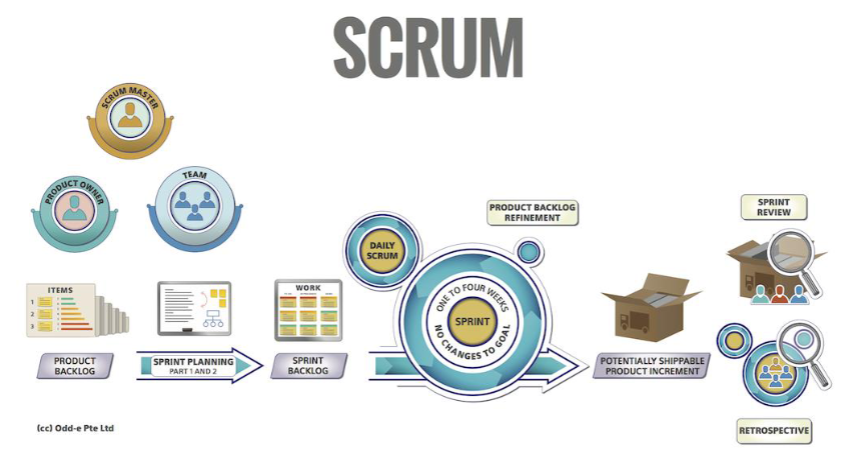

# Incremental SDLC

## Process  
series of progressive and interdependent steps by
which an end is attained.
- Defined Process
- Empirical Process
A process model is a model (i.e. a simplified description) of the steps
you need to take to achieve your goal.

### Defined Process Control
- A process with a well-defined set of steps. Given the same inputs, a defined process should
produce the same output every time.
- Great when in an environment with relatively low volatility that can be easily predicted; given the
same inputs, a defined process should produce the same output every time based on its
repeatability and predictability nature.

### Empirical Process Control
- In empirical process control, you expect the unexpected. Empirical process control has the
following characteristics:
- Learn as we progress
- Expect and embrace change
- Inspect and adapt using short development cycles
- Estimates are indicative only and may not be accurate

## Software Development Life Cycles (SDLCs)
Activities in SDLC:
- Requirements gathering
- Systems / Architectural Design
- Implementation / Coding / Integration
- Testing
- Evolution:
  - Delivery and Release - Deployment
  - Maintenance

### Waterfall
- a plan driven approach
- Requirement: Find out what stakeholders want the product to do
- Analysis: Figure out exactly what this means (create Software Requirements Specification)
- Design: Determine how to build the product (create design documentation)
- Implementation: Code & integrate (create working product)
- Maintenance: Repair or enhance
- Retirement: Remove from service
- Development is broken into phases that 
  - not overlap
  - document of output
- Does not work well when
  - Errors are possible in requirement elicitation, analysis and design
  - Requirements are hard to figure out or subject to change

### Incremental SDLC Model
- Combines iterative 
- Each Mini Waterfall produces deliverable increments of software
- Iteratively construct partial implementations of a system
- Each sub-release incrementally add functions
- Pros
    - Develop major requirements first
    - Risk of software development spread
    across multiple increments
    - Lessons learnt from each increment can
    complement future increments
    - Each release of the mini waterfall phase
    delivers an operational increment
    - Initial product delivery is faster
    - Reduces the risk of failure

- Cons
  - Requires good planning and design
  - Designing the increments may not be
  straightforward
  - Requires early definition of requirements to
  identify the increments
  - Model is rigid and does not allow for
  iterations within each increment or “mini
  waterfall”

### Agile Principles

- Our highest priority is to satisfy the customer through early and continuous delivery of valuable software.

- Welcome changing requirements, even late in development. Agile processes harness change for the customer's competitive advantage.

- Deliver working software frequently, from a couple of weeks to a couple of months, shorter timeframes is the preference.

- Business people and developers must work together daily throughout the project.

- Build projects around motivated individuals. Give them the environment and support they need and trust them.

- The most efficient and effective method of conveying information to and within a development team is face-to-face conversation.

- Working software is the primary measure of progress.

- Agile processes promote sustainable development. The sponsors, developers, and users should be able to maintain a constant pace indefinitely.

- Continuous attention to technical excellence and good design enhances agility.

- Simplicity – the art of maximizing the amount of work not done – is essential.

- The best architectures, requirements, and designs emerge from self-organising teams.

- At regular intervals, the team reflects on how to become more effective, then tunes and adjusts its behaviour accordingly.

### Agile Framework
#### Kanban
- Billboard
- Visualising work
- limiting work in progress
- maximising efficiency
#### Scrum
- helps teams work together to develop,
deliver and sustain complex products.
- Everything is divided into timeframes
- 
#### eXtreme Programming (XP)
- frequent releases in short development cycles
- intended to improve productivity and
  - introduce checkpoints at which new customer requirements
  can be adopted.
- Pair Programming

## Scrum 
### Foundations
- Scrum is founded on empiricism and lean thinking.
- Empiricism asserts that knowledge comes from experience and making decisions
based on what is observed.
- Lean thinking reduces waste and focuses on the essentials.
- Iterative, incremental approach to optimise predictability and to control risk.
- Scrum engages groups of people who collectively have all the skills and expertise
to do the work and share or acquire such skills as needed.
### Scrum Pillars
- Transparency
  - Emergent and visible to those who work
  - Transparency enables inspection.
  - Inspection without transparency is misleading and wasteful.
  - Scrum Artefacts help with transparency
- Inspection
  - Goals must be inspected frequently and diligently to detect potentially undesirable problems.
  - Scrum Events help with inspections
- Adaptation
  - Process should be adjusted if deviated
  - Minimise the deviation
  - Self management
### Scrum Documentations
- Product Backlog
- Definition of Done
- Sprint Backlog
- User Stories
- Acceptance Criteria
- Burndown Charts
- Release Plans
- Retrospective Documents
- Technical Handover Document
- User Manuals