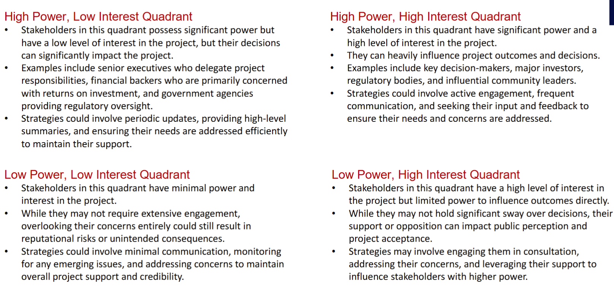
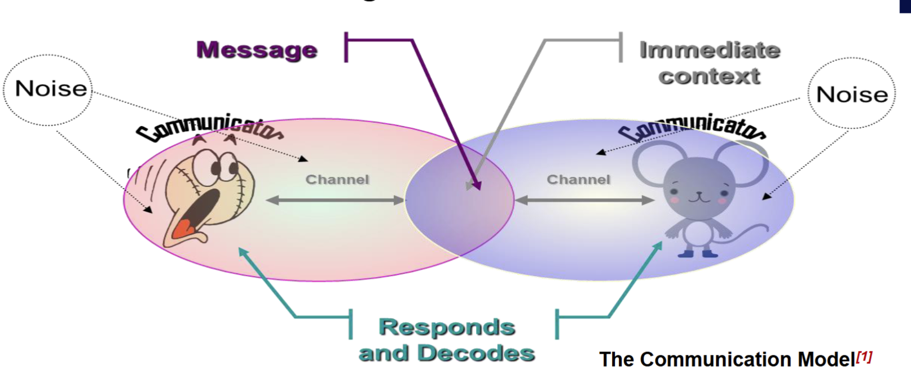

# Stakeholder and Communication
## PMP
- A PMP is a formal approved document that defines how the project is executed, monitored and controlled. It may be a summary or a detailed document.
- It is a document that is owned, controlled and populated by the Project Manager and is used throughout the project.
- A good PMP provides the required level of detail across key project components and is the one source of truth for all parties involved across the project.

### Project Charter vs PMP

### PMP
Project Information
- Executive Summary
- Financial Authority to proceed
- Key Stakeholders
- Scope
- Delivery approach / SDLC - e.g. Waterfall or Agile
- Resources / People
- Key Milestones
- Project Budget
- Lessons learned applied to this project
- Constraints

 Project Governance
- Roles and Responsibilities
- Mandatory Project Planning / Key Additional Activities
    - Schedule
    - Risk Management
    - Cost Estimation
    - Quality Assurance
    - Configuration Management (Change Management)

#### Agile to do or not to do (document)
- Myth:
1. Agile Means No Documentation
2. Agile Development is often misunderstood as eliminating the need for documentation
- Reality:
1. Agile values working software over comprehensive documentation, but does not dismiss
documentation entirely
2. This misconception stems from the Agile Manifesto’s emphasis on working software, leading
some to believe that documentation is unnecessary

- Agile Encourages Smart Documentation:
There are project situations in which documentation is absolutely required
    - User Stories, Flowcharts, Wireframes, Client Meetings, Regulatory requirements

Agile suggests to be “Smart” about the Documentation

1. Agile promotes 'just barely good enough' (JBGE) documentation—sufficient to support the
project without overburdening the team.
2. Documentation is created 'just in time' (JIT) when it is needed, not upfront, to avoid outdated
or unnecessary details.
3. The focus is on living, collaborative documentation that evolves with the project.

- Why document in Agile
1. To meet stakeholder requirements and maintain organizational memory.
    - While Working Software is the primary goal, you also need to develop supporting documentation required to use,
    operate, support, maintain, and extend the software over time
2. To support communication with external groups, such as software outsourcing teams.
    - Not always possible to always have all stakeholders available
    - Not always possible to co-locate a development team
3. For audit and compliance purposes.
    - Depending on the type of system that you are developing, there may be some audit needs. In these cases, you need to follow a well-defined process and capture proof that you did so
4. To present, clarify, and solidify complex ideas.

### Documents in Agile
- Product Vision:
    - Essence of the product, including cost estimates, predicted benefits, risks, and milestones.
- Project Overview:
    - Summary of critical project information like user contacts, technologies, and tools.
    - Maintained throughout development for onboarding new team members.
- Design Decisions:
    - Record of key design and architecture choices made during the project.
    - Integrated into system overviews and source code.
- Requirements Documents:
    - Overview of system functionality through use cases, user stories, or prototypes.
    - Captures requirements as executable specifications.
- Operations Documentation:
    - Describes system dependencies, backup procedures, and troubleshooting guidelines.
- System Documentation:
    - Technical and business architecture overview, covering high-level requirements.
    - Ensures critical information is preserved if the development team transitions.
    - Designed to minimize the need for extensive user training.
- Scrum Artifacts:
    - Information that a Scrum Team and stakeholders use to describe the product being developed, actions undertaken to produce the same, and actions performed during the execution of the project.
    - Essential for every Scrum Team to enable transparency, inspection, and adaption.
- The 7 Scrum:
    - Product Vision 
    - Product Backlog
    - Sprint Vision
    - Sprint Backlog
    - Product Increments
    - Burndown Charts
    - Definition of Done

### Project Issue Management
1. Record issue (discrepancy report)
    - Issue needs to state the difference between observed and expected behaviour.
    - Also: Software Version, Who reported, When reported, How to reproduce, ...
2. Analyse issue to determine whether observed behaviour is the specified behaviour.
3. Categorise issue based on analysis
    - observed /= specified: defect
    - observed == specified: change request (for expected behaviour)
- Change requests:
    - are managed through a different process to defects
    - have cost implications (fixed-price vs time-and-materials vs in-house vs ...)
    - may end up in the product backlog.

### Stakeholder Analysis
- Stakeholder Identification: Identifying all individuals, groups, or organizations who may be affected by, or have an interest in the project, whether directly or indirectly.
- Understanding Stakeholder Interests: Examining stakeholders' interests, objectives, expectations, and concerns regarding the project to ensure their needs are addressed.
- Assessing Stakeholder Influence: Evaluate the level of influence or power each stakeholder holds over the project's outcomes, decision-making processes, or resources.
- Prioritizing Stakeholder Engagement: Prioritize stakeholders based on their importance, level of influence, or degree of impact on the project's success.
- Managing Stakeholder Relationships: Proactively manage relationships with stakeholders by anticipating their reactions, addressing potential conflicts, and fostering open communication and collaboration.

#### Level of Stakeholder Engagement
- Unaware: Unaware of the project and its potential impacts on them
- Resistant: Aware of the project yet resistant to change
- Neutral: Aware of the project yet neither supportive nor resistant
- Supportive: Aware of the project and supportive of change
- Champion / Leading: Aware of the project and drives change

#### Stakeholder Management Plan 
- Current and desired engagement levels
- Interrelationships between stakeholders
- Communication requirements
- Potential management strategies for each stakeholder
- Methods for updating the stakeholder management plan

#### Stakeholder Analysis 
- Names and Organisations of Key Stakeholders
- Their Role on the Project
- Unique Facts about Each Stakeholder
- Level of Interest in the Project
- Influence on the Project
- Suggestions and Strategies for Managing Relationships with each Stakeholder

#### Power Interest Grid

### Team and group
- A group is a collection of people
- A team is a group that is (or is expected to be)
    - cohesive
    - focused on a common purpose or goal
- All teams are groups, but not all groups are teams!

- The ability to work with others is an important life and career skill, no matter what your future plans are
    - almost all nontrivial software development is done as a team
    - almost all nontrivial research is done as a team
    - surveys of potential employers of IT graduates consistently rate teamwork and interpersonal skills
- Software engineering is about delivering systems that are large or complicated or mission-critical (or all of these things!)
    - To make these systems work, we will need
        - lots of people
        - working together effectively
    - And these teams need to be structured carefully, because the structure of the organization can affect the success of the project

#### Bad team formation
- Autocracy
    - A boss deliver tasks to teams, failure if boss is sick
    - low chance of cooperation
- Anarhy
    - No boss
    - No one know what to do
- Democratic
    - Teams get bogged down in decision-making
    - Nobody's fault if something goes wrong -> less incentive to make good decisions
#### Better Team
- Collaborative 
    - fairlyformation
    - make decision in own area of expertise
    - avoids problem from democratic
    - avoids problem from autocracy
    - Agile is forms a collaborative team
- Extreme Programming Team
    - All code is written by two programmers on a same PC -> (Pair programming), one writing and one review
    - Test drawn by one and conduct by another
    - Knowledge not all lost if one leaves
    - Inexperienced and experienced can learn from each other
- Scrum Team
- A variant of collaborative team model and a bit democratic as well.
- Team size of 7 +/- 2
- Accountabilities
- “Scrum Master”
    - Ensures team is following rules of Scrum.
    - Protects team from outside barriers.
- “Product Owner”
- Representative of client/customer
    - ONE person.
    - Responsible for what will be developed and in what order.
- “Developers”
    - Responsible for determining how to deliver and to some extent what’s been decided in the Sprint Backlog and by the Product Owner.
    - fixed-length “iterations”
- Team agrees how much work to be done in an iteration
- Team members sign up for tasks within an iteration (Sprint – 2-4 weeks in length preferably).
- Number of mechanisms
    - Customer/Client sees progress at the end of every Sprint!
    - Everybody sees what everybody else is doing
    - Burndown charts track progress within Sprint
    - It shows how many tasks still need to be done in a Sprint.

#### Teamicide
- Defensive management
    - if management makes it clear to the team that they’re not trusted, the team loses motivation
- Bureaucracy
    - hard to maintain your enthusiasm when you’re doing lots of mindless paperwork
- Physical separation
    - teams work best when members have spontaneous, casual interactions as well as planned and guided interactions
    - spontaneous interactions enable creativity but are impossible if team members aren’t co-located
- Fragmentation of time
    - because you can’t concentrate if you keep switching back and forth between projects

- Quality-reduced product
    - idea might be to lower costs or to ship earlier but it’s still demotivating to ship a poor product
- Phony deadlines
    - i.e. trying to make team members work faster by imposing artificially-close deadlines
    - really a form of defensive management: management doesn’t trust the team to work hard unless they are nagged
- Clique control
    - i.e. management may have policies that actively interfere with the health of teams (e.g. regularly rotating people through different roles)
    - the authors see this as a consequence of management’s failure to understand teams, since teams seldom exist at management level

#### Distributed Team
- Aka Virtual team, remote team...
- Why?
    - Support region, live in region, work from home, access to high or lower cost talent
- Comms:
    - Less frequent and less rich (visual and behavioural clues)
    - Can introduce cultural or other overheads/barriers (e.g. timezones)
    - Can reduce biases, help comms with local stakeholders, support for 24-hour work cycle
    - Visual team activities (e.g. design) can be particularly challenging

### Communication Management
- An important work skill 

#### Communication Challenges

### Importance of Listening

- Passive Listening – Lectures
    - Taking in the information without processing or reacting
- Active or Empathetic Listening – Tutorials
    - Show interest
    - Asks questions
    - Avoid distractions
    - Use direct eye contact
    - Do not interrupt
    - Read both verbal and nonverbal messages

### Importance of Communication
Because successful Project Managers MUST have the ability to:
    Read / understand the client
    Run a meeting
    Communicate (written & orally) thoughts accurately
    Manage the team
    Influence your environment
    Ensure alignment and buy-in to the purpose / outcome

## Communication Plan
- A large proportion of a Project Managers time is spent on communication
- Project Managers often use a Communications Plan to assist in managing and
coordinating key communication messages
- A good project Communication Plan:
    - Ensures communications is effective and efficient
    - Allows the Project Manager to be pro-active
    - Sets a common understand of what will be done and when
    - Clarifies who is responsible for key items, what will be delivered and by who
- A Communications Plan defines:
    - What information will be communicated - detail and format
    - Communication Channel - meetings, email, telephone, web portal, etc.
    - When information will be distributed – frequency of formal and informal comms
    - Who is responsible
    - Communication needs of stakeholders
    - Resources the project will allocate for communication
    - How sensitive or confidential information will be communicated & who will authorise this
    - The flow of project communications
    - Any constraints (internal or external) which affect project communications
    - Any standard templates, formats, or documents the project must use
    - Escalation process for resolving any communication-based conflicts or issues

### Key Communication Considerations
**Items to remember**
- Rarely does the receiver interpret a message exactly as the sender intended
- Geographical location and cultural background affect the complexity of
communications
    - Different working hours
    - Language barriers
    - Different cultural norms
- Communication helps manage conflicts effectively
- Spend time developing communication skills – practice & feedback
- Choose the channel appropriately

**Communication Conflicts**
Conflict is the single most undermanaged activity in projects and if left unresolved will destroy a project. Key causes include:
- Schedule
- Intellectual disagreements
- Personalities
- Project Priorities
- Manpower
- Technical
- Administration
- Personality
- Cost