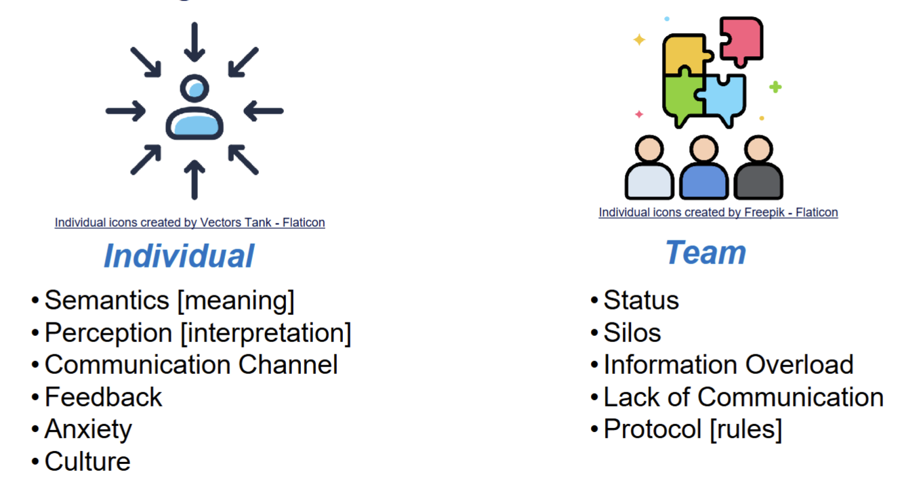
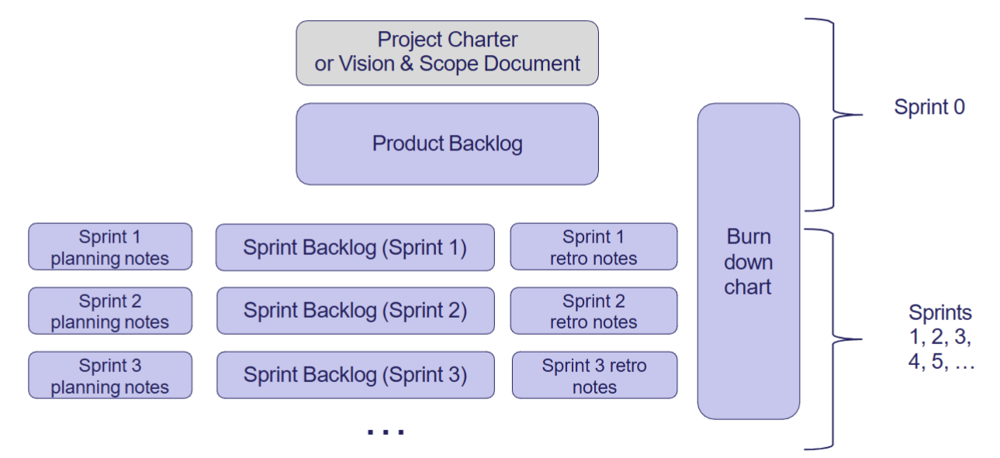
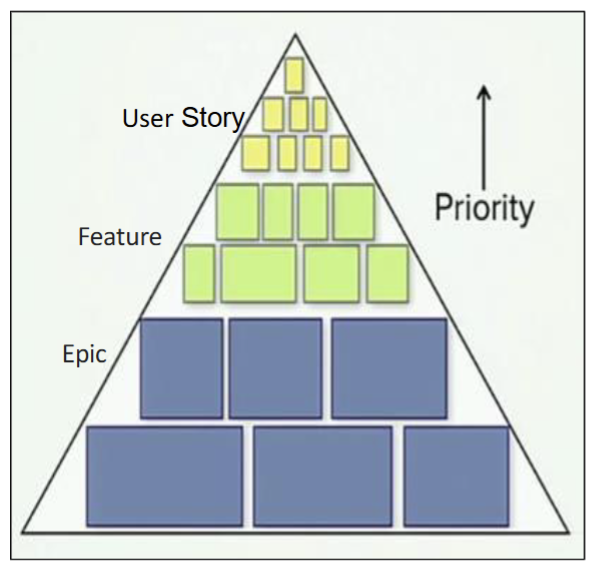
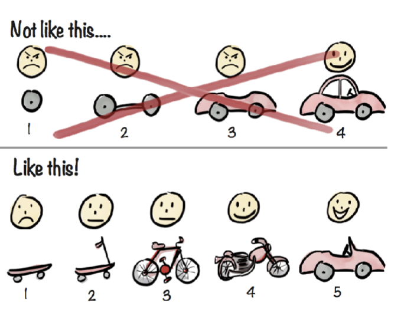
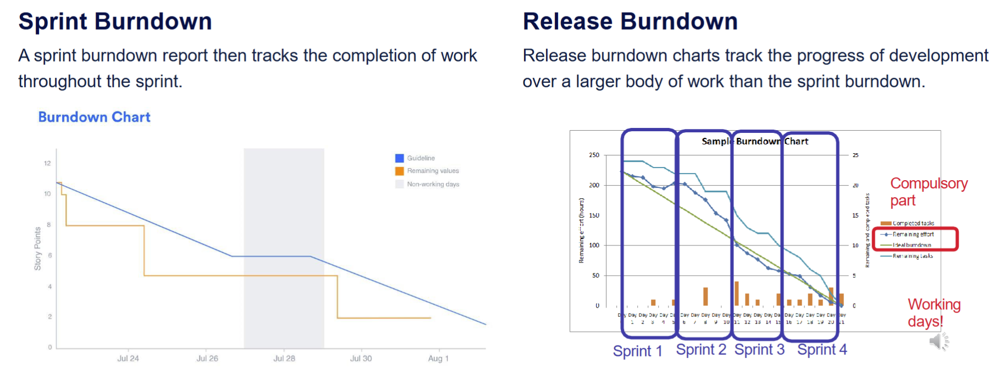
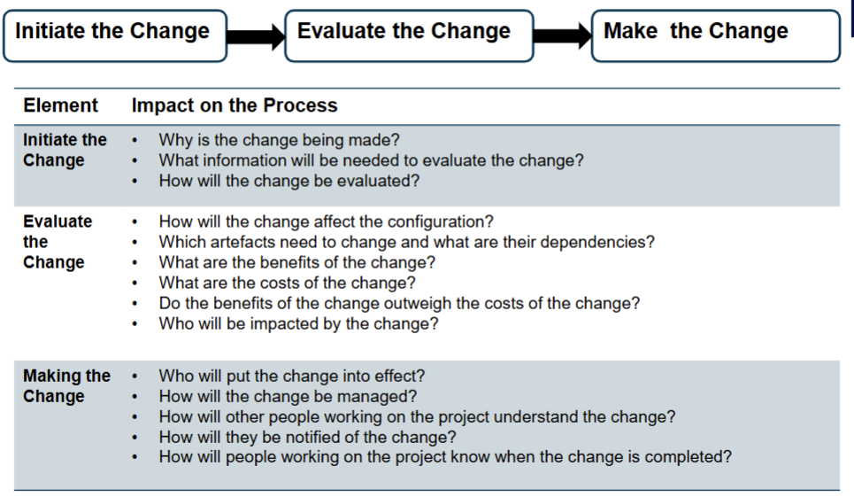
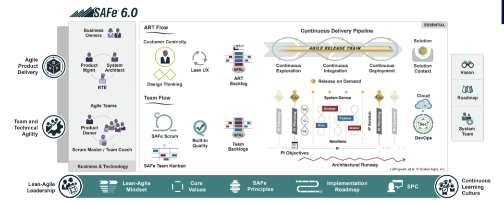
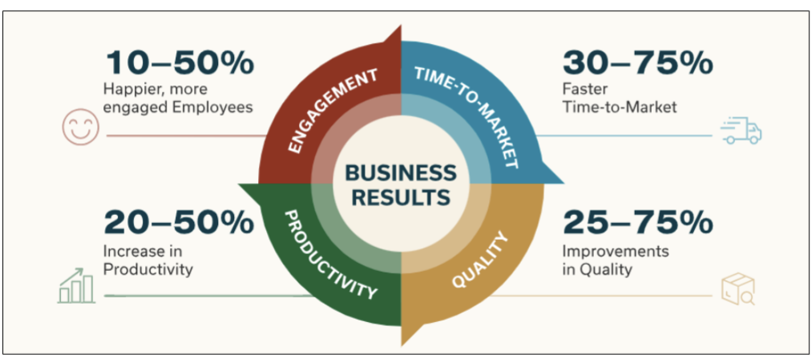

# 📚 Table of Contents

- [Projects](#projects)
- [Incremental SDLC](#incremental-sdlc)
- [Risk Management](#risk-management)
- [Stakeholder and Communication](#stakeholder-and-communication)
- [Agile](#agile)
- [Software Quality Management](#software-quality-management)
- [Formal Project Scheduling](#formal-project-scheduling)
- [Project Tracking and Control](#project-tracking-and-control)
- [Ethics in Professional Practice](#ethics-in-professional-practice)
- [Configuration Management](#configuration-management)
- [Scrum at Scale - SAFe (Scaled Agile Framework)](#scrum-at-scale---safe-scaled-agile-framework)

---

# Projects

## Importance of "Process"
- Process 
    - Systematic series of actions or steps taken to achieve a specific
goal. It involves planning, executing, monitoring, and controlling all aspects
of a project.
- Product 
    - The result or output of the process. For a software project, it
includes the software system and associated artefacts.

### Emphasized process
- Foundation for Success – A robust process critical for delivering
successful projects
- Industry Relevance – Professionals rely and value sound processes in
all aspects of the project development life cycle
- Skill Development – Focus on developing skills that are essential for
managing and executing projects effectively.

## Project
- A temporary endeavour to create a unique product, service or outcome.

### Key characteristics:
- Introduce CHANGE to the organisation
- TEMPORARY, it has a defined beginning and end
- CROSS-FUNCTIONAL, cuts across organisational boundaries
- Deals with the UNKNOWN
- UNIQUE
- They all vary in SIZE

### Why projects
- Provides strategic alignment of key activities and visibility at the appropriate levels
- Mechanism to prioritise activities (Benefits, Regulatory, HW Refresh)
- Allows organisations to deliver change in a structured and formal manner outside of Business As
Usual
- Effective and efficient management of organisations limited resources (people & $’s)
- Establish ownership and accountability – Process and the Benefits
- Provide clarity, buy-in and agreement across what will be done, when, who, why and the
outcomes

## Project Management
- Project Management is the planning, delegating, monitoring and controlling of all aspects of a
project, and motivating those involved to achieve the project objectives within the expected targets
for time, costs, quality, scope, benefits and risks.
- Organising and structuring scarce resources
- Managing risk
- Identifying and clearing issues
- Managing and implementing change
- Retaining and re-using knowledge
- Organisational wide learning from past success and failures

- Maintain Balance in **Resource, Scope, and Time**

### Project Manager
- Tradition Project Manager Key Activities

- Agile
- No defined PM role
- Key activities are spread / shared across team members
    - Key project activities are still undertaken formally with appropriate documentation
- Some alignment between a Scrum Master and a Project Manager
- Move from Command and Control to Servant Leadership
    - Coaches and facilitates teams to deliver
    - Emphasises objectives
    - Is invested in the program's overall performance
    - Asks the teams for answers
    - Allows the teams to self-organise and hit their stride
    - Assists others with fixing issues

### How Projects success/fail
- Successful: project is completed on-time and on-budget, with all features and functions as initially specified.
- Challenged: completed and operational but over-budget, over the time estimate or offers fewer features and functions
than planned.
- Failed: project is cancelled at some point during the development cycle.

### Project Screening
- Approach to 
    - Select;
    - Prioritise;
    - Have oversight; and
    - Drive accountability across all projects
- Business Case: establish mechanisms to judge whether the project is (and remains) desirable, viable and achievable to support decision making in its initial and continued investment.
    - Provides a factual base for key decisions makers to decide if the project should be undertaken
    - Demonstrates how the project adds value to the organisation
    - Has a set of pre-defined standard organisational characteristics (costs, benefits, risk, etc.)
    - It is not all about size - size depends on the cost / benefit
    - It is a living document throughout the project that should be reviewed and signed off at key
    stages
- Business case contains:
    - Executive summary
    - Reasons / explanation of why it is required
    - Business options
    - Expected benefits
    - Expected dis-benefits
    - Timescale
    - Costs
    - Investment appraisal
    - Major risks

### Money!
- ROI is income divided by investment
    - $ROI = (total discounted benefits – total discounted costs) / total discounted
    costs$
    - High ROI means more profit

## Project Charter

# Incremental SDLC

## Process  
series of progressive and interdependent steps by
which an end is attained.
- Defined Process
- Empirical Process
A process model is a model (i.e. a simplified description) of the steps
you need to take to achieve your goal.

### Defined Process Control
- A process with a well-defined set of steps. Given the same inputs, a defined process should
produce the same output every time.
- Great when in an environment with relatively low volatility that can be easily predicted; given the
same inputs, a defined process should produce the same output every time based on its
repeatability and predictability nature.

### Empirical Process Control
- In empirical process control, you expect the unexpected. Empirical process control has the
following characteristics:
- Learn as we progress
- Expect and embrace change
- Inspect and adapt using short development cycles
- Estimates are indicative only and may not be accurate

## Software Development Life Cycles (SDLCs)
Activities in SDLC:
- Requirements gathering
- Systems / Architectural Design
- Implementation / Coding / Integration
- Testing
- Evolution:
  - Delivery and Release - Deployment
  - Maintenance

### Waterfall
- a plan driven approach
- Requirement: Find out what stakeholders want the product to do
- Analysis: Figure out exactly what this means (create Software Requirements Specification)
- Design: Determine how to build the product (create design documentation)
- Implementation: Code & integrate (create working product)
- Maintenance: Repair or enhance
- Retirement: Remove from service
- Development is broken into phases that 
  - not overlap
  - document of output
- Does not work well when
  - Errors are possible in requirement elicitation, analysis and design
  - Requirements are hard to figure out or subject to change

### Incremental SDLC Model
- Combines iterative 
- Each Mini Waterfall produces deliverable increments of software
- Iteratively construct partial implementations of a system
- Each sub-release incrementally add functions
- Pros
    - Develop major requirements first
    - Risk of software development spread
    across multiple increments
    - Lessons learnt from each increment can
    complement future increments
    - Each release of the mini waterfall phase
    delivers an operational increment
    - Initial product delivery is faster
    - Reduces the risk of failure

- Cons
  - Requires good planning and design
  - Designing the increments may not be
  straightforward
  - Requires early definition of requirements to
  identify the increments
  - Model is rigid and does not allow for
  iterations within each increment or “mini
  waterfall”

### Some formal SDLCs
- Prototyping

- Rapid Prototyping

- Spiral Model

- Incremental
- Iterative 

### Agile Principles

- Our highest priority is to satisfy the customer through early and continuous delivery of valuable software.

- Welcome changing requirements, even late in development. Agile processes harness change for the customer's competitive advantage.

- Deliver working software frequently, from a couple of weeks to a couple of months, shorter timeframes is the preference.

- Business people and developers must work together daily throughout the project.

- Build projects around motivated individuals. Give them the environment and support they need and trust them.

- The most efficient and effective method of conveying information to and within a development team is face-to-face conversation.

- Working software is the primary measure of progress.

- Agile processes promote sustainable development. The sponsors, developers, and users should be able to maintain a constant pace indefinitely.

- Continuous attention to technical excellence and good design enhances agility.

- Simplicity – the art of maximizing the amount of work not done – is essential.

- The best architectures, requirements, and designs emerge from self-organising teams.

- At regular intervals, the team reflects on how to become more effective, then tunes and adjusts its behaviour accordingly.

### Agile Framework
#### Kanban
- Billboard
- Visualising work
- limiting work in progress
- maximising efficiency
#### Scrum
- helps teams work together to develop,
deliver and sustain complex products.
- Everything is divided into timeframes
- 
#### eXtreme Programming (XP)
- frequent releases in short development cycles
- intended to improve productivity and
  - introduce checkpoints at which new customer requirements
  can be adopted.
- Pair Programming

## Scrum 
### Foundations
- Scrum is founded on empiricism and lean thinking.
- Empiricism asserts that knowledge comes from experience and making decisions
based on what is observed.
- Lean thinking reduces waste and focuses on the essentials.
- **Iterative**, incremental approach to optimise predictability and to control risk.
- Scrum engages groups of people who collectively have all the skills and expertise
to do the work and share or acquire such skills as needed.
### Scrum Pillars
- Transparency
  - Emergent and visible to those who work
  - Transparency enables inspection.
  - Inspection without transparency is misleading and wasteful.
  - Scrum Artefacts help with transparency
- Inspection
  - Goals must be inspected frequently and diligently to detect potentially undesirable problems.
  - Scrum Events help with inspections
- Adaptation
  - Process should be adjusted if deviated
  - Minimise the deviation
  - Self management
### Scrum Documentations
- Product Backlog
- Definition of Done
- Sprint Backlog
- User Stories
- Acceptance Criteria
- Burndown Charts
- Release Plans
- Retrospective Documents
- Technical Handover Document
- User Manuals

### Model Selection
- Formal Models
  - Customer knows what they want at the start
  - Stable, precise and known requirements
  - Change is not expected
  - Mature technologies and tools
- Agile Models
  - Customer gives time to project
  - Requirements continue to emerge
  - Change is welcome
- Hybrid
  - Client has a prescriptive model established

### Difference and Misconception Between Agile and Waterfall
- Slipping from Agile back into Waterfall
  - Team falls to linear planning and rigid phase boundaries
- Doing a lot of short waterfall and thinking is Agile
  - Agile is **Iterative** and not in many small phases
- Waterfall masquerading as Agile Software Development
  - label as Agile but not showing critical iteration stuff

### Agile Suitability 
- Unified Stakeholder Role – Customer, user, and other stakeholders act as a single entity.
- Small, Co-located Teams – Agile works best with small teams in one location.
- Highly Available Users – Users must provide constant, prompt feedback.
- Low Emphasis on Non-Functional Aspects – Security, alternate options, and risks
- Simple & Gradual Requirements Evolution – No major conflicts or complex prioritization needed. Functional increments can be provided quickly. No conflict management
- Minimal Documentation – Maintenance rely on team knowledge rather than heavy formal documentation.
- Early Release Over Rigorous Verification – Requirements verification over coding less important than early release.
- Limited Code Refactoring Needs – Changes should not require major redesigns. People generally in charge of maintenance are product developers
- Agility is not all-or-nothing – Projects can adopt Agile to varying degrees based on which assumptions hold

## Read Tutorial 2 about Evaluation of Agile

# Risk Management
- An uncertain event or condition that, if it occurs, has a positive or
negative effect on the project objectives - PMBOK

### Risk vs Uncertainty
- Uncertainty:
    - Lack of complete certainty about an event/outcome
    - The event/outcome has a probability of less than 1
    - E.g. outcome of a sporting event
- Risk:
    - Uncertainty that has an impact
    - E.g. If you have placed a bet on the sporting event, or have some other personal stake in it, then there is risk associated with the outcome of the sporting event
- Risk is a result of uncertainty but not every uncertainty is a risk

## Formal Risk Management

### Why Risk Management
- Projects have many possible risks, that could have        significant impacts on the outcomes:
    - Business risks
    - Project risks
    - Product risks
- A planned Risk Management process is essential for:
- minimising the impact of potential negative risks while maximising the impact of potential positive risks

## Risk Management Process
- Plan
    - How to approach and plan risk management activities?
- Identify
    - Identify the possible risks
- Analyse and Assess (Qualitative and Quantitative):
    - Identify the relative priorities of the identified risks
- Respond (Action):
    - How can we reduce the likelihood or impact of risks?
- Monitor and Control:
    - How can we detect the ongoing status of our risks? How can we control them effectively and efficiently?

### Plan
- output Risk Management Plan (RMP) that documents the procedures for managing risks throughout a project
- team should review the RMP and understand and implement the organisation’s and the sponsor’s approaches to risk management

## RISK
- What is the chance of event
- What is the impact of event on project
- Is there Degree of Control

- Generic Risk : Threats or opportunities common to every software project (e.g. staff turnover, budget and schedule pressures)
- Product-specific Risks:
- Threats or opportunities specific to the product, and can only be identified by people who have a clear understanding of the product and technology
- Project risks
    - Affect the planning of the project
- Product risks
    - Affect the quality or performance of the outcome being developed e.g. Design problems, implementation problems, interface problems, maintenance problems, verification problems
- Business risks
    - Affect the economic success of the project e.g. No demand for product, loss of management support, loss of external funding for the project etc

## Risk Management Process
- Risk identification
    - Identify project, product and business risks;
- Risk Analysis
    - Access Likelihood and consequences of these risks;
- Risk Planning
    - Draw up plans to avoid or minimize the effects of the risk;
- Risk Monitoring
    - Monitor the risks throughout the project.

### Risk Identification
- Pondering
    - This simply involves an individual taking the “pencil and paper” approach of risk identification, which involves sitting and thinking about the possible risks that could occur in the project.
- Interviews
    - Interviewing **project stake holders**, or asking them to fill out questionnaires, to harness their knowledge of a domain
- Brainstorms
    - The team can use a risk framework or the **Work Breakdown Structure (WBS)** to identify threats and opportunities
- Checklists
    - This involves the use of standard checklists of possible risk drivers that are collated from experience
    - These checklists are used as triggers for experts to think about the possible types of risks in that area
- Delphi Technique
    - A group of experts are asked to identify risks and their impact
    - The responses are them made available to each other anonymously
    - The experts are then asked to update their response based on the responses of others – repeated until consensus is reached
- SWOT Analysis (Case Study)
    - Strengths, Weaknesses, Opportunities and Threats
    - This technique allows finding strengths and weaknesses as well
#### SWOT Analysis
- Strengths: characteristics of the business or project that give it an advantage over others
- Weaknesses: characteristics that place the business or project at a disadvantage relative to others
- Opportunities: elements in the environment that the business or project could exploit to its advantage
- Threats: elements in the environment that could cause trouble for the business or project

## Risk Case Study - Bank of America Debit Card Fee
- Stakeholder: Bank of America
    - 2012 – Bank of America started charging its customers $5 per month to gain access to their funds using their debit cards
- RESULT
    - Thousands of customers dumped Bank of America and moved away to other banks and credit unions
    - A Risk Management Plan could have saved Bank of America bad press and the loss of business from lots of old-time customers
- TAKE AWAY
    - ‘Going full steam’ into a project – without little or no research on potential consequences as key project risks can turn projects into a disaster

### Risk Analysis and Assessment
- Risk analysis
    - Identify each identified risk’s probability and impact
- Risk assessment
    - Prioritize risks so that an effective risk strategy can be formulated
- Two approaches for analysis and assessment:
    - Qualitative: subjective assessment based on experience/intuition
    - Quantitative: mathematical and statistical techniques

#### Risk Assessment

#### Qualitative
- The important steps of risk analysis (**Qualitative**) are:
    1. Estimating the risk probability (P)
        - this is an estimation of the probability that the risk will occur
        - usually done based on expert judgement
    2. Estimating the risk impact (I)
        - the impact that the risk will have on the project
        - Usually measured in a scale of 1 – 5 (or 10):
            - no impact; (2) minimal impact; (3) moderate impact; (4) severe impact;
            and (5) catastrophic impact
        - Impact can be expressed as a monitory value
    3. Compute risk exposure (or P *I Score)
        - $Risk exposure= 𝑃∗ 𝐼$

    4. Identifying the root cause
        - It is important that one identifies the root causes of all risks
        - If this root cause can be identified, then all of these risks can be controlled
        by addressing the root cause

- Risk Matrix

#### Quantitative
- They are based on modelling a particular risk situation - probability distributions of risks are the main consideration
- Common Techniques:
    - Decision Tree Analysis
    - Simulation
    - Sensitivity Analysis

### Respond to Risk
- Four common strategies to handle **threats**:
    1. Accept or Ignore
    This means that we believe that the risk is of an acceptable exposure, that we hope that the event does not occur, or that the risk exposure is less than the cost of any techniques to avoid, mitigate, or transfer it.
    2. Avoid
    This means that we completely prevent the risky event from occurring, by either ensuring its probability is 0, or ensuring its impact 0.
    3. Mitigate
    This involves employing techniques to reduce the probability of the risk, or reduce
    the impact of the risk. This results in a residual risk — that is, a risk consisting of the same event, but with a lower probability/impact, and therefore low exposure. We then must analyse the residual risk as we would our primary risk.
    4. Transfer
    This involves transferring the burden of the risk to another party. Insurance is one example of risk transfer, in which the impact of the risk is offset by payments from the insurer. Another example is outsourcing a portion of the work to somebody with more knowledge and expertise, which comes at a cost.
- Four common strategies to handle **opportunities**:
    1. Exploit:
    Add work or change the project to make sure the opportunity occurs
    2. Enhance:
    Increase the probability and positive impact of risk events
    3. Share:
    Allocate ownership of opportunity to a third-party
    4. Accept:
    This means that we believe that the cost to exploit or enhance is not justifiable so do nothing about it.

### Monitor and Control Risk
- New threats and opportunities may arise in the course of the project – they must be identified, analysed and responded to
- Risk monitoring must be part of the overall monitoring and control of the project

- Tools for monitoring and controlling:
- Risk Audits:
    - external team looks at comprehensiveness of the identification process and ensuring other procedures and processes are in place
- Risk Reviews:
    - internal reviews of risks periodically that result in status reports generated for PM and those who need-to-know
- Risk status meetings:
    - risks must be reviewed and discussed in project status meetings, which are periodically held in projects (e.g. weekly meetings)

## Risk in Agile
- Plan
    - We do not plan and document everything in Agile but Risk Registers are documented.
- Identify
    - Risk assessment workshops conducted by Product Owner to identify areas
    - Risks are added as user stories and prioritized in Product Backlog
- Analyse and Assess (Qualitative and Quantitative):
    - Team members analyses/assess and plan these risks during sprint planning
    - They can add new risks as they discover
- Respond (Action):
    - Mitigation strategies defined for risk items and completed within sprint.
- Monitor and Control:
    - Product Owners receive regular updates on risk register
    - Scrum master monitors risks in daily stand ups

## Case Study - Google Checkout
**Google Checkout** was an
Online payment processing service provided by Google
Aimed at simplifying the process of paying for online purchases
Discontinued on November 20, 2013 and the service moved
to **Google Wallet** (now called **Google Pay**).
Users would store their **credit or debit card** and shipping
information in their Google account
Purchase at participating stores by clicking an on-screen button.
Google Checkout provided **fraud** protection and a unified page
for tracking purchases and their status.

# Stakeholder and Communication
## PMP
- A PMP is a formal approved document that defines how the project is executed, monitored and controlled. It may be a summary or a detailed document.
- It is a document that is owned, controlled and populated by the Project Manager and is used throughout the project.
- A good PMP provides the required level of detail across key project components and is the one source of truth for all parties involved across the project.

### Project Charter vs PMP

### PMP
Project Information
- Executive Summary
- Financial Authority to proceed
- Key Stakeholders
- Scope
- Delivery approach / SDLC - e.g. Waterfall or Agile
- Resources / People
- Key Milestones
- Project Budget
- Lessons learned applied to this project
- Constraints

 Project Governance
- Roles and Responsibilities
- Mandatory Project Planning / Key Additional Activities
    - Schedule
    - Risk Management
    - Cost Estimation
    - Quality Assurance
    - Configuration Management (Change Management)

#### Agile to do or not to do (document)
- Myth:
1. Agile Means No Documentation
2. Agile Development is often misunderstood as eliminating the need for documentation
- Reality:
1. Agile values working software over comprehensive documentation, but does not dismiss
documentation entirely
2. This misconception stems from the Agile Manifesto’s emphasis on working software, leading
some to believe that documentation is unnecessary

- Agile Encourages Smart Documentation:
There are project situations in which documentation is absolutely required
    - User Stories, Flowcharts, Wireframes, Client Meetings, Regulatory requirements

Agile suggests to be “Smart” about the Documentation

1. Agile promotes 'just barely good enough' (JBGE) documentation—sufficient to support the
project without overburdening the team.
2. Documentation is created 'just in time' (JIT) when it is needed, not upfront, to avoid outdated
or unnecessary details.
3. The focus is on living, collaborative documentation that evolves with the project.

- Why document in Agile
1. To meet stakeholder requirements and maintain organizational memory.
    - While Working Software is the primary goal, you also need to develop supporting documentation required to use,
    operate, support, maintain, and extend the software over time
2. To support communication with external groups, such as software outsourcing teams.
    - Not always possible to always have all stakeholders available
    - Not always possible to co-locate a development team
3. For audit and compliance purposes.
    - Depending on the type of system that you are developing, there may be some audit needs. In these cases, you need to follow a well-defined process and capture proof that you did so
4. To present, clarify, and solidify complex ideas.

### Documents in Agile
- Product Vision:
    - Essence of the product, including cost estimates, predicted benefits, risks, and milestones.
- Project Overview:
    - Summary of critical project information like user contacts, technologies, and tools.
    - Maintained throughout development for onboarding new team members.
- Design Decisions:
    - Record of key design and architecture choices made during the project.
    - Integrated into system overviews and source code.
- Requirements Documents:
    - Overview of system functionality through use cases, user stories, or prototypes.
    - Captures requirements as executable specifications.
- Operations Documentation:
    - Describes system dependencies, backup procedures, and troubleshooting guidelines.
- System Documentation:
    - Technical and business architecture overview, covering high-level requirements.
    - Ensures critical information is preserved if the development team transitions.
    - Designed to minimize the need for extensive user training.
- Scrum Artifacts:
    - Information that a Scrum Team and stakeholders use to describe the product being developed, actions undertaken to produce the same, and actions performed during the execution of the project.
    - Essential for every Scrum Team to enable transparency, inspection, and adaption.
- The 7 Scrum:
    - Product Vision 
    - Product Backlog
    - Sprint Vision
    - Sprint Backlog
    - Product Increments
    - Burndown Charts
    - Definition of Done

### Project Issue Management
1. Record issue (discrepancy report)
    - Issue needs to state the difference between observed and expected behaviour.
    - Also: Software Version, Who reported, When reported, How to reproduce, ...
2. Analyse issue to determine whether observed behaviour is the specified behaviour.
3. Categorise issue based on analysis
    - observed /= specified: defect
    - observed == specified: change request (for expected behaviour)
- Change requests:
    - are managed through a different process to defects
    - have cost implications (fixed-price vs time-and-materials vs in-house vs ...)
    - may end up in the product backlog.

### Stakeholder Analysis
- Stakeholder Identification: Identifying all individuals, groups, or organizations who may be affected by, or have an interest in the project, whether directly or indirectly.
- Understanding Stakeholder Interests: Examining stakeholders' interests, objectives, expectations, and concerns regarding the project to ensure their needs are addressed.
- Assessing Stakeholder Influence: Evaluate the level of influence or power each stakeholder holds over the project's outcomes, decision-making processes, or resources.
- Prioritizing Stakeholder Engagement: Prioritize stakeholders based on their importance, level of influence, or degree of impact on the project's success.
- Managing Stakeholder Relationships: Proactively manage relationships with stakeholders by anticipating their reactions, addressing potential conflicts, and fostering open communication and collaboration.

#### Level of Stakeholder Engagement
- Unaware: Unaware of the project and its potential impacts on them
- Resistant: Aware of the project yet resistant to change
- Neutral: Aware of the project yet neither supportive nor resistant
- Supportive: Aware of the project and supportive of change
- Champion / Leading: Aware of the project and drives change

#### Stakeholder Management Plan 
- Current and desired engagement levels
- Interrelationships between stakeholders
- Communication requirements
- Potential management strategies for each stakeholder
- Methods for updating the stakeholder management plan

#### Stakeholder Analysis 
- Names and Organisations of Key Stakeholders
- Their Role on the Project
- Unique Facts about Each Stakeholder
- Level of Interest in the Project
- Influence on the Project
- Suggestions and Strategies for Managing Relationships with each Stakeholder

#### Power Interest Grid

### Team and group
- A group is a collection of people
- A team is a group that is (or is expected to be)
    - cohesive
    - focused on a common purpose or goal
- All teams are groups, but not all groups are teams!

- The ability to work with others is an important life and career skill, no matter what your future plans are
    - almost all nontrivial software development is done as a team
    - almost all nontrivial research is done as a team
    - surveys of potential employers of IT graduates consistently rate teamwork and interpersonal skills
- Software engineering is about delivering systems that are large or complicated or mission-critical (or all of these things!)
    - To make these systems work, we will need
        - lots of people
        - working together effectively
    - And these teams need to be structured carefully, because the structure of the organization can affect the success of the project

#### Bad team formation
- Autocracy
    - A boss deliver tasks to teams, failure if boss is sick
    - low chance of cooperation
- Anarhy
    - No boss
    - No one know what to do
- Democratic
    - Teams get bogged down in decision-making
    - Nobody's fault if something goes wrong -> less incentive to make good decisions
#### Better Team
- Collaborative 
    - fairlyformation
    - make decision in own area of expertise
    - avoids problem from democratic
    - avoids problem from autocracy
    - Agile is forms a collaborative team
- Extreme Programming Team
    - All code is written by two programmers on a same PC -> (Pair programming), one writing and one review
    - Test drawn by one and conduct by another
    - Knowledge not all lost if one leaves
    - Inexperienced and experienced can learn from each other
- Scrum Team
- A variant of collaborative team model and a bit democratic as well.
- Team size of 7 +/- 2
- Accountabilities
- “Scrum Master”
    - Ensures team is following rules of Scrum.
    - Protects team from outside barriers.
- “Product Owner”
- Representative of client/customer
    - ONE person.
    - Responsible for what will be developed and in what order.
- “Developers”
    - Responsible for determining how to deliver and to some extent what’s been decided in the Sprint Backlog and by the Product Owner.
    - fixed-length “iterations”
- Team agrees how much work to be done in an iteration
- Team members sign up for tasks within an iteration (Sprint – 2-4 weeks in length preferably).
- Number of mechanisms
    - Customer/Client sees progress at the end of every Sprint!
    - Everybody sees what everybody else is doing
    - Burndown charts track progress within Sprint
    - It shows how many tasks still need to be done in a Sprint.

#### Teamicide
- Defensive management
    - if management makes it clear to the team that they’re not trusted, the team loses motivation
- Bureaucracy
    - hard to maintain your enthusiasm when you’re doing lots of mindless paperwork
- Physical separation
    - teams work best when members have spontaneous, casual interactions as well as planned and guided interactions
    - spontaneous interactions enable creativity but are impossible if team members aren’t co-located
- Fragmentation of time
    - because you can’t concentrate if you keep switching back and forth between projects

- Quality-reduced product
    - idea might be to lower costs or to ship earlier but it’s still demotivating to ship a poor product
- Phony deadlines
    - i.e. trying to make team members work faster by imposing artificially-close deadlines
    - really a form of defensive management: management doesn’t trust the team to work hard unless they are nagged
- Clique control
    - i.e. management may have policies that actively interfere with the health of teams (e.g. regularly rotating people through different roles)
    - the authors see this as a consequence of management’s failure to understand teams, since teams seldom exist at management level

#### Distributed Team
- Aka Virtual team, remote team...
- Why?
    - Support region, live in region, work from home, access to high or lower cost talent
- Comms:
    - Less frequent and less rich (visual and behavioural clues)
    - Can introduce cultural or other overheads/barriers (e.g. timezones)
    - Can reduce biases, help comms with local stakeholders, support for 24-hour work cycle
    - Visual team activities (e.g. design) can be particularly challenging

### Communication Management
- An important work skill 

#### Communication Challenges

### Importance of Listening

- Passive Listening – Lectures
    - Taking in the information without processing or reacting
- Active or Empathetic Listening – Tutorials
    - Show interest
    - Asks questions
    - Avoid distractions
    - Use direct eye contact
    - Do not interrupt
    - Read both verbal and nonverbal messages

### Importance of Communication
Because successful Project Managers MUST have the ability to:
    Read / understand the client
    Run a meeting
    Communicate (written & orally) thoughts accurately
    Manage the team
    Influence your environment
    Ensure alignment and buy-in to the purpose / outcome

## Communication Plan
- A large proportion of a Project Managers time is spent on communication
- Project Managers often use a Communications Plan to assist in managing and
coordinating key communication messages
- A good project Communication Plan:
    - Ensures communications is effective and efficient
    - Allows the Project Manager to be pro-active
    - Sets a common understand of what will be done and when
    - Clarifies who is responsible for key items, what will be delivered and by who
- A Communications Plan defines:
    - What information will be communicated - detail and format
    - Communication Channel - meetings, email, telephone, web portal, etc.
    - When information will be distributed – frequency of formal and informal comms
    - Who is responsible
    - Communication needs of stakeholders
    - Resources the project will allocate for communication
    - How sensitive or confidential information will be communicated & who will authorise this
    - The flow of project communications
    - Any constraints (internal or external) which affect project communications
    - Any standard templates, formats, or documents the project must use
    - Escalation process for resolving any communication-based conflicts or issues

### Key Communication Considerations
**Items to remember**
- Rarely does the receiver interpret a message exactly as the sender intended
- Geographical location and cultural background affect the complexity of
communications
    - Different working hours
    - Language barriers
    - Different cultural norms
- Communication helps manage conflicts effectively
- Spend time developing communication skills – practice & feedback
- Choose the channel appropriately

**Communication Conflicts**
Conflict is the single most undermanaged activity in projects and if left unresolved will destroy a project. Key causes include:
- Schedule
- Intellectual disagreements
- Personalities
- Project Priorities
- Manpower
- Technical
- Administration
- Personality
- Cost

# Agile

## Scrum Artifacts

- Product Backlog
    - The Product Backlog represents the larger picture and lists epics and stories for a product.
    - Product goal is the commitment for product backlog
- Sprint Backlog
    - A Sprint Backlog is concerned with the stories and tasks that are to be undertaken within a sprint.
    - The items in sprint backlogs come from the product backlog during sprint planning.
    - Sprint Goal is the commitment for the sprint backlog
- Increment
    - The increment (or potentially shippable increment, PSI) is the sum of all the Product Backlog items completed during a sprint and all previous sprints.
    - The increment must be in a usable condition regardless of whether the Product Owner decides to release it.
    - At the end of a sprint, the increment must be done according to the Scrum Team's criteria called Definition of Done (DoD). i.e. DoD is the commitment for an Increment.

## Sprint Planning
- key Scrum ceremony
- the team selects and commits to user stories for the upcoming sprint
Preparation: Product Backlog Refinement/Grooming     - review for relevance, completeness, priority
1. Review the Product Backlog: The Product Owner presents prioritized user stories.
2. Define Sprint Goal: The team sets a clear, achievable objective.
3. Select User Stories: The team pulls stories from the backlog that align with the Sprint Goal.
4. Estimate Effort: The team assigns story points using the Fibonacci sequence (1, 2, 3, 5, 8, 13, etc.). Teams also use other popular estimation techniques such as T-Shirt Sizing, Planning Poker, or the Bucket System.
5. Break Down Stories into Tasks: Identify subtasks and assign responsibilities.
6. Finalize Sprint Backlog: The team commits to completing selected stories.

### MoSCoW

- Must have:
    - Requirements labelled as “MUST” have to be included in the delivered scope in order for it to be a success.
    - If even one “MUST” requirement is not included, the project delivery should be considered a failure.
- Should have:
    - “SHOULD” requirements are also critical to the project.
    - Will generally all need to be delivered for a successful project.
- Could have:
    - Requirements labelled as “COULD” are often seen as nice to have.
- Won’t have:
    - “WON’T” requirements are either the least-critical, lowest-payback items, or not appropriate at this time.

### Scope
- Scrum will typically have 2-4 week sprints. Scope is planned accordingly.
- What if the team finishes early? Options include:
    - Additional work on planned scope (testing, review, ...) if of value
    - Pull in additional user stories if they fit
    - Refactoring (improve non-functional characteristics) if planned and fits
    - Do work outside the sprint (preparation for later sprint, prototyping, ...)
- What if the team can’t finish everything in the plan?
    - Reduce planned work (testing, review, ...) if still meets DoD and QA permits
    - Push one or more user stories out of sprint scope (may be able to split a story on the fly)
- What if there are changes to user stories in the planned print scope during the sprint?
    - Reduced scope     - see finishes early for options.
    - Increased scope     - must reduce plan to its original size (options: see can’t finish everything)

### Requirements 
- Requirements are what determine whether your software is
    - complete
    - Correct
- Because requirements tell you what behaviour is considered correct, they’re hugely important to testing
    - every requirement should be tested
    - each test should be able to be traced back to corresponding requirements

### Getting requirements 
    - In Waterfall models, requirements are elicited once, at the start of the project, usually by a team of business analysts.
    - Agile processes place more emphasis on a continuing relationship with the client or their representative, but there still needs to be a requirements brainstorming session during project inception
- Requirements in traditional system
    - Traditional models: text-based
    - all of the requirements must be written down
    - the written description must contain all the information necessary to begin to design and implement
    - typically completed before design begins

- Requirements in Agile
    - Idea: can be very hard to nail down a complete set of requirements in advance, so don’t try to do that
    - Instead, get the Product Owner involved in development
    - get something up and running as quickly as possible
    - get Product Owner to pick which features to add next, based on client priorities
    - try to add as much value as possible per iteration
    - repeat for each sprint
    - Can’t avoid doing some requirements management during inception     - otherwise you won’t have anything to do during your first iteration

### User Stories
- SHORT DESCRIPTIONS OF A FEATURE EXPLAINED FROM THE PRESPECTIVE OF THE PERSON WHO DESIRES THE FUNTIONALITY, USUALLY A USER OF THE PRODUCT
- 3 Steps Process also called 3 C’s
    - Card
    - Conversation
    - Confirmation
- As a [user role],
I want to [goal action],
So that [reason/benefit]

- (Sprint) User Story
    - Detailed technical level
    - A developer’s perspective
    - A conversation placeholder
- Feature User Story
    - Product capabilities
    - Business level detail
    - Product Owner perspective
- Epic User Story
    - Lacks detail
    - New business services
    - A product

#### User Story Characteristic
- INVEST 
    - Negotiable
        - Are **not a contract**, not detailed specifications.
        - Are a kind of “notes” to remind the team on to discuss and collaborate to clarify the details near the time of development
        - High level, no details, as the goal is
        - To avoid a false impressions of precision or completeness
        - To highlight that further discussions are a part of the process
    - Independent
        - Should be as independent as possible
        - Dependencies might lead to difficulties with prioritizing and planning
    - Valuable 
        - Should be **valuable** to the user (or owner) of the product – like traditional req. specification should contain only necessary requirements
    - Estimable
        - Need to provide enough information to **estimate**, without being too detailed.
    - Small
        - Should be “**small enough**”: small in the sense of the feature scope, not in the sense “very short text”
        - Should be detailed enough for the team to start work from, and further details can be established and clarified at the time of development.
        - Generally: A team must be able to finish a user story **within** the sprint in which it starts
    - Testable
        - Should provide enough details of how the User Story will be **tested**.
- Deliberately leave out a lot of important details: Help getting the high-level picture of requirements (provide a “bone” for eliciting during scrum meetings)
- Product Backlog is evolving during the whole length of the project.
- Elaborated and modified through the project based on user input
- Centered on the result and the benefit of the thing you're describing
- User- and usage-centric requirements elicitation: Focus on what the user wants to do, and not what the user wants the system to do:
- By focusing on the user’s goal and vision, you can ensure that the users get the functionality that they require

### User Role 
- Broaden the scope from looking at one user
- Allows users to vary by
    - What they use the software for
    - How they use the software
    - Background
    - Familiarity with the software / computers
- Definition:
    - A user role is a collection of defining attributes that characterize a population of users and their intended interactions with the system

### Epics
A large user story is typically referred to as an epic
There is no “magic size” at which we start calling a user story an epic
Generally: an epic is a user story that will take more than one or two sprints to develop and test
Epics are split into smaller user stories, so that a story can be completed within a sprint.

### Conditions of Satisfaction
- a high-level acceptance test (acceptance criteria) that will be true after the user story is complete

### Product Backlog
- Requirements for a system, expressed as a prioritized list
- Each item should have value to the users/customers
- Is managed and owned by a Product Owner
- Spreadsheet, Trello board, etc.

## Increment 
- The product increment (or potentially shippable increment, PSI) is the sum of all the Product Backlog items completed during a sprint and all previous sprints.
The increment must be in a usable condition regardless of whether the Product Owner decides to actually release it.
At the end of a sprint, the increment must be done according to the Team’s Criteria called Definition of Done (DoD)

### Definition of Done
- The exit-criteria to determine whether a product backlog item is complete.
- In many cases the DoD requires that all regression tests should be successful.
- The definition of "done" may vary from one Scrum team to another but must be consistent within one team.
- List of activities that add verifiable/demonstrable value to the product
- DoD is orthogonal to user acceptance criteria (functional acceptance) for a feature: It is a comprehensive checklist of necessary, value-added activities that assert the quality of a feature and not the functionality of that feature.
- Ensures that only truly done features are delivered, not only in terms of functionality but in terms of quality as well.
- Goals:
    - to build a common understanding within the Team about Quality and Completeness
    - to be a checklist that User Stories (or PBIs) are checked against
    - to ensure the increment shipped at the end of the Sprint has high quality and that the quality is well understood by all involved.

#### Example of DoD
- Every new feature is tested during the sprint.
- Testers & developers work closely together. Testing is done by the whole team.
- Every sprint has its own User Acceptance testing phase (Sprint Review).
- A small piece of working software is delivered to the client at the end of the sprint.
- Client does User Acceptance test.

### DoD vs AC
- DoD Levels 
    - DoD for a Product Backlog Item (e.g., writing code, tests and all necessary documentation)
    - DoD for a Sprint (e.g., install demo system for review)
    - DoD for a Release (e.g., writing release notes)

## Agile Effort Estimation
- Story Points
    - a story point is a relative measure of the size of a user story (recall that the requirements of the system are documented using user stories)
- Velocity
    - velocity is a measure of productivity of team, which is represented by the number of story points delivered in a specified time period

### Story Point
- Traditional software teams give estimates in a time format: days, weeks, months.
- Many agile teams, however, have transitioned to story points.
- Story points rate the relative effort of work
    - Relative to completed user stories
    - Relative to other stories currently being estimated
- Story points drawn from abstract scales (no units)
    - Fibonacci: 0, 1, 2, 3, 5, 8, 13, 21, 34, 55, 89
    - or modified Fibonacci: 0, ½, 1, 2, 3, 5, 8, 13, 20, 40, 100
    - or powers of 2: 0, 1, 2, 4, 8, 16
    - or T-shirt sizes: XS, S, M, L, XL, XXL

- We are better at relative estimation; with time out of the picture, we are free to concentrate on comparing user stories rather than trying to guess their absolute size accurately.
- Times don’t account for the non-project related work that inevitably creeps into our days: emails, meetings, etc.
- Each team will estimate work on a slightly different scale, which means their velocity (measured in points) will naturally be different. This, in turn, makes it harder to play politics using velocity as a weapon.
- The relative size of story points provides some information to the product owner to assess the business value against the level of the effort.

### Velocity 
- is the rate at which a team can complete story points within a sprint
- Working at a sustainable pace is one of the Agile principles.
- We need an understanding of the number of story points we can complete in a Sprint at a sustainable pace.
- For the first few sprints, expected velocity is a matter of guesswork
    - not sure about estimation yet
    - might have issues at the start of development which settle down through successive sprints
- After a while, the team move closer to a steady pace of development
- Velocity will be disrupted due changes to team membership, the development approach being undertaken, the kind of system being developed and so on.
- A stable situation supports a stable velocity and accurate story point estimation.

### Estimation Process 
1. Develop user stories for the system.
2. Estimate the number of story points for each story (discussed later).
3. Use the team’s velocity (points per sprint or week) from previous experience to estimate the delivery time of a defined scope
4. During development, measure the actual velocity of the team.
5. Using this velocity, re-estimate the time it will take to deliver the scope.

- Estimate by analogy
    - There are no units for story points, always base our measures on other stories. If story A is about the same size as story B, they should have the same number of story points.
- Decompose a story
    - By decomposing a story into the tasks that are required to complete the story, we can find measures that we know about the tasks and combine them to provide a total measure.
- Use the right units
    - The relative units should not be too fine grained.  A pattern-based scale is used. For example, measures can only be 1, 2, 4, 8, or 12 or numbers in the Fibonacci sequence.
- Use group-based estimations
    - For a story that is to be implemented by a team, the whole team should provide estimates. Techniques such as the Delphi method or its adaptations can be used to reach consensus.

- Issues
    - Analysis Paralysis:
        - Spending too much time attempting to develop detailed estimates.
        - Delaying making commitments until all of the information required to make decision has high level of certainty.
    - Cavalier approach:
        - Not worrying about managing uncertainty and risk at all and just starting the project with no planning at all.
        - Assuming that whatever uncertainty and risk is inherent in the project will be discovered and somehow work itself out as the project succeeds.

### Estimation Technique
- Fibonacci
- Planning Poker
    - use poker cards to vote and iterate until reach final decision
- T-shirt size
    - use XXS,XS,S.... then convert to numeric

#### Computing Velocity 
$V = \frac{SI}{T_i}$

#### Estimated Delivery Time

$T = \frac{\sum_{i=1}^{n} SP_i}{V}$

### Burndown Charts
- Burn-down chart is used to track work completed against time.
- The x-axis is the time frame, and the y-axis is the amount of remaining work left that is labelled as story points. (y-axis could be based on person-hours).
- The chart begins with greatest amount of remaining work, which decreases during the project and slowly burns to nothing

#### Sprint Burndown vs Release Burndown 

### Warning
- Be very careful using story points to measure developers’ performance:
- if team members end up competing, they will rush their code
- rushed code is buggy code
- working at an unsustainable pace causes burnout, which destroys team morale and makes their code worse

## Planning 
- Agile projects approach typically defers planning decisions to “the last responsible moment”

    - You typically start with a high-level plan that is sufficient for defining at least the vision, scope, and objectives.
    - The details of the plan and the requirements are further
    elaborated as the project progresses – to the level of detail is needed at that point to support whatever level of planning and estimation is required for the project
    - By the last responsible moment, we mean the latest point in time that a decision can be made without impacting the outcome of the overall project.

### Planning Strategy
It is necessary to provide key milestones and assumptions
as they will help stakeholders see why you are using **Rolling Wave Planning** and what to expect as the project progresses.

- Progressive Elaboration
    - Planning too far in advance == some amount of speculation
    -Quite often, that speculation is wrong and will result in wasted effort in replanning later, might also require reworking any work that has been done based on erroneous assumptions.
    - Planning requirements [too far in advance] should not stop you from progressing with the implementation works in the project.
    - Requirements should only be defined to the extent needed to support whatever decisions or action is required at that particular point in time.

### Developing requirements in Agile
- simplicity and 
- limiting a solution to what is “just barely good enough”
- Exist a optimum point and additional features beyond the point diminish the value
- close collaboration with the stakeholders
- It is good 
    - to start with the simplest and most basic solution possible
    - then add to it incrementally and iteratively only to the extent that it adds value to the user.

### Release Level 
- release is set of product increments that is released to the customer.
- happens when project is bigger with multiple releases.
- While In small projects:
    - the product backlog alone can provide enough project overview;
    - the size, duration and deliverables are easily recognised, and there is no need to synchronise or group deliverables or teams.
### Characteristics of a Release
- Releases are defined by date, theme, and planned feature set
- Releases are defined at the system or program level by the Product Owner
- Scope is the variable
- Date and quality are not variable, which highlights the need to use a prioritised product backlog as the basis of a planning event
- All teams must commit to the same rhythm of iterations. When all teams work to the same rhythm, the discovery and management of dependencies occurs automatically during the planning activities
- There are fixed release dates across all teams of the program with a typical interval of two to four months.
- A release can stretch over six to nine months, although two to four months is more common.

### Plan Regressively 
1. Vision & Scope document
2. Product Backlog: Specify the PBIs (Product Backlog Items) on the basis of the features
    - PBIs are about the what
    - PBIs represent business value (ideally, from the customers’ perspective)
    - PBI == user story / epic
    - User story should be small enough to be completed within a sprint
3. Sprint Backlog: Specify tasks on the basis of PBIs.
    - Sprint tasks are about the how
    - A task is a step by the team to create the business value (represented by PBI)
    - A task should be small – no bigger that 1 day of work
    - Some teams prefer to specify small enough PBIs, so that tasks are not even necessary

#### Analysis Agile Planning
- Common Pitfalls
    - Poor estimation and Overcommitting -> commit to all three user stories without considering their actual capacity and velocity from previous sprints
    - Lack of Clarity – Project Release Planning and Sprint Allocation -> fail to explain their overall release plan and how they managed the product backlog
    - Lack of Continuous Testing -> solely on development during the first two sprints, leaving testing to the final sprint -> Bugs are discovered late
    - Lack of Clarity on Testing Procedures -> "We did some testing in the last sprint," -> is not enough to explain -> to solve : should outline their testing strategy, explaining how testing was integrated into each sprint and what tools or methods were used.
    - Inadequate Sprint Planning
    - Last Minute Technology Decisions
    - Unclear Roles and Responsibilities
- Effective Agile Planning
    - Realistic Estimation and Commitment
    - Continuous Testing -> Issues are caught ealier 
    - Thorough Sprint Planning
    - Early Technology Decisions
    - Clear Roles and Responsibilities

# Software Quality Management

- Evidence shows that we cannot simply fix up our software post-hoc and add in quality attributes after building the system.
- Quality must be built into the software from the beginning.

## What is Software Quality

- End-User Perspective
    - users judge the quality by interaction, program is reliable, reasonable performance, easy to use, etc.
    - external quality characteristic

- Developer Perspective
    - number of faults, easily modifying, testing, understanding system design
    - internal quality characteristic

### Cost of Software Quality Management
- $cost = cost_{conformance} + cost_{nonconformance}$

- Conformance 
    - Deliver product meet requirements and are fit for purpose
    - e.g. the development of quality management plan, cost of analysing and managing product requirements, cost for testing.
- NonConformance
    - Taking responsibility for failures or not meeting quality expectations

- Quality Management adds additional cost, consume resources such as time, money, human.
    - Trade off when implementing Quality Management between Conformance and NonConformance. 
    - Balancing **cost** of implementing software quality processes to follow (conformance), and **risk** of having to fix problems if they are identified further into the project (nonconformance).
        - The total cost of getting the software right is higher the later into the project issues are detected

- Cost is **High**
    - cost can be extremely harm:
        - Bug in missle launch system kills thousands
        - Bug in Radiation treat kills patient by overdose
    - not juts in money
        - error found in development phase may take 4.9 hours
        - same error after releasing could take 15.3 hours

### Conformance : Cost vs Stage
- Consider an issue detected in a system under development
- The total project effort in direct relation to that issue will be greater than if the system was developed without that issue. 
    - There was effort involved so that getting the issue
        - The later in project, the higher the effort
    - Effort around the resolution process: change approval
    - Effort solving the issue
        - Minor: change color of displayed item
        - Significant: system workflow need rebuilt
        - Project Stopper: current architecture throughput can't handle transactions fast enough
- The view of cost is assuming the issue being resolved
- Cost will be different if we don't bother fixing it

## Quality Management Process
- Performing Quality Assurance
    - Periodically evaluating overall project performance to ensure the project will satisfy the relevant quality standards.
- Planning Quality
    - Incorporating quality standards into project design
    - Identifying which quality standards are relevant to the project and how to satisfy those standards.
- Performing Quality Control
    - Monitoring specific project results to ensure that they comply with the relevant quality standards, while identifying ways to improve overall quality.

### Performing Quality Assurance
- Define or select **Quality Standards**
    - a standard can be simply as **set of rules for ensuring quality**
    - standard is important in quality managment porcess
- Two type of standard
    - Product Standard
        - apply to the product being developed -> how the product look like
    - Process Standard
        - define the process to follow during development -> writing document xd

#### Verification & Validation
- Verification  -> following the correct development procedure
    - attempt to ensure that the product is built correctly, the output products of an activity meet the specifications imposed on them in previous activities.
    - normally involves two (sets of) artifacts: req. spec. vs design, design vs code; this is an internal developer activity
    - ensuring you are **building the system right** (the right way)
- Validation -> build the correct product
    - ensure that the right product is built—that is, the product fulfils it specific intended purpose
    - going back to the stakeholders to check if the product meets their requirements, this normally involves something/someone external
    - ensuring that you are **building the right system** (to meet stakeholder needs)
#### Types of Testing
- a form of verification
- Unit Test
   - Used to test each individual component (often a program) to ensure it is defect-free.
   - Performed before commencing integration testing.
- Integration Testing
   - Occurs between unit testing and system testing.
   - Ensures that subset(s) of the overall system work together correctly.
- System Testing
   - Tests the entire system as one entity. Ensures that the entire system is working correctly.
- User Acceptance Testing
   - Testing performed by end users prior to accepting the delivered system. Ensures that the system fits the needs of users of the system.

### Quality Planning
- Incorporating quality standards into project design
    - Identify which quality standards are relevant to the project and how to satisfy them
- Outcome of the process is Software Quality Plan (SQP), or Software Quality Assurance Plan (SQAP)

#### SQP template
Software Quality Assurance Plan
- Product Overview
   - A description of the product, intended market, and quality expectations.
- Product Plan
   - The critical release dates and responsibilities    - could point to the schedule.
- Quality Goals
   - The quality goals and plans for the product, including identification and justification of critical product quality attributes.
- Process Description
   - The quality assurance processes that should be used for product development and management (reviews, audits etc).
- Document and Coding Standards
   - Standards for the documents and coding standards.
- Risks and Risk Management
   - The key risks that might affect product quality and the actions to address these risks (could provide a link to appropriate risks in the Risk Management Plan).

### Quality Control and Monitoring
- Involves monitoring the software development process to ensure that the quality assurance procedures and standards specified in the Software Quality Plan are being followed 

- Reviews 
    - common project management technique for monitoring and control of trageted project aspects or artefacts
1. Technical Review
   - common technique used for verification and validation (details to follow)
2. Business Review
   - assess the project's progress, performance, and outcomes to date to ensure alignment with project goals and stakeholder expectations.
3. Management Review
   - review actual progress - scope, schedule, budget, and resourcing    - against a baseline plan.

#### Techinical Review
- Artefacts produced during the development process are reviewed as a way of identifying problems and addressing them earlier in the project
- By **peer reivew** in the dev team with **authors included** 
- Aim to uncover problems in an artefact and seeking ways to improve
- a **soft** method for QA -> nothing is executed

- Pros
1. Can be performed on any software artefact, whereas many “hard” methods of quality assurance, such as testing and measurement, can be performed only on executable artefacts.
2. Earlier detection of problems in software artefacts leads to lower costs of resolution.
3. Studies show that roughly 30-70% of all programming faults found in a project were located using source code reviews, and up to 80% according to studies performed by IBM. Some studies demonstrated that review techniques found several types of faults that testing failed to find, and vice-versa.
4. Reviews find the actual faults in source code, in contrast to testing, which merely indicates that there is a fault somewhere in the program. After a fault is detected with testing, it must then be located.
5. Due to internal pressure of getting software releases out the door, programmers make more mistakes when correcting faults that were found during testing than they do correcting faults during the review phase.
- Cons
1. Can be time and resource consuming.
2. Should be carefully planned and executed to get the desired outcomes.
- Types
1. Informal Reviews
2. Formal Reviews
    Including:
    1. Walkthroughs
    2. Code Inspections/Code Review
    3. Audits

- Informal Reviews
   - A simple desk check or casual meeting with a colleague which aims to improve the quality of a document.
   - No formal guidelines or procedures that are followed.
   - The effectiveness of informal reviews is considerably less than formal reviews, because of the lack of diversity found in a group.
   - Checklists are tools that can help to improve the effectiveness of a review.
   - A checklist is a list of questions that the reviewer must answer about an artefact, however, the
questions are generic questions about that type of artefact.
   - Less time and resource consuming than a formal review.

- Formal Review (general):
- A meeting with multiple stakeholders such as developers, testers, client.
   - The group approach has benefits of bringing out different perspectives.
- Meeting should adhere to the following constraints.
   - The review team should be 3-5 members carefully chosen.
   - The meeting should last no longer than 90 minutes.
   - Following are the critical roles.
        - Review Leader: responsible for organizing the review.
        - Author: at least one author should be present.
        - Reviewers: at least two or three non-author stakeholders
        - Recorder: responsible for recording all important review comments
        - The review meeting could recommend one of the following:
   - Accept without further changes.
   - Accept with proposed changes.
   - Reject the artefact    - this requires a re-review after modifications

- Walkthrough
- coule be for code, a design or a document
- a review process where author leads a group of reviewers by walking them through the artefact under review
- Difference with a general formal review
    - Moderator, that leads the review is the author of the artefacts being reviewed
    - Reviewers do not need preparation
    - WHen defects or in consistent are found, possible solutions are discussed

- Inspection
- Inspection could be for code, or a design, or a document
- An inspection checklist for the relevant kind of artefact is used.
- Following are the main differences from a general formal review:
    - Reviewers need to have examined the artefact against the checklist.
    - Minor defects will be collated to be addressed outside of the review meeting
    - More substantial defects, and possible solutions, are discussed.
- Code Inspection:
- This form of inspection is conducted on a code artefact using a checklist based on the coding standard.

- Audit 
- Reviews a specified process or product to determine if it conforms to the defined standards.
- It is a type of technical review where the authors of the artefact being audited are not involved in the audit process at all.
- Audits can focus on a subset of examples as an indicator of the broader set; this subset could be selected randomly or with a particular focus.
- Audits can be performed by a team that is completely external to an organisation
- Procuct Audits: confirm product meets standards
- Process AUdits: ensure team follows process

## Agile Centric Software Quality Management

### Agile QA mindset
1. Provide Continuous Feedback
    - Fosters a culture of open communication and improvement.
2. Deliver Value to the Customer
    - Agile QA prioritizes ensuring software not only meets technical requirements but also delivers real value to the customer, aligning tests and quality goals with customer needs.
3. Enable Face-to-Face Communication
    - Programmers should be able to talk to others including programmers and business experts easily.
4. Have Courage
    - Courage to raise concerns, suggest improvements, and advocate for quality.
5. Keep It Simple
    - Simplifying processes, tests, and code leads to more efficient and effective QA practices.
6. Practice Continuous Improvement
    - Constantly evaluating and improving testing processes, tools, and techniques. Helps teams adapt and maintain high-quality standards.
7. Respond to Change
    - The ability to quickly adapt testing strategies in response to changing requirements or feedback.
8. Self-Organize
    - Agile QA teams are often self-organizing, with members taking initiative and making decisions collaboratively to achieve quality objectives.
9. Focus on People
    - Agile QA emphasizes people over processes and tools, fostering a supportive and productive environment.
10. Enjoy
    - Enjoyment and passion for the work can significantly improve team morale, creativity, and productivity.

### Principle of Agile QA
1. Testing early and often with an emphasis on the usefulness of "Shift Left" approach.
    - “Shift-Left” refers to moving testing activities earlier into the development process, so that software quality is improved
2. Importance of automation.
3. Open feedback and communication channels

### Agile QA Methodologies
- Test Driven Development (TDD)
- Acceptance Test-Driven Development (ATDD)
- Behavior-Driven Development (BDD)

#### Test Driven Development QA Practices
- a software development approach.
- It dictates that developers should first write unit tests for a new feature before writing the actual code to implement that feature.
Three Laws of Test-Driven Development (Robert Martin)
1. You are not allowed to write any production code unless it is to make a failing unit test pass.
2. You are not allowed to write any more of a unit test than is sufficient to fail; and compilation
failures are failures.
3. You are not allowed to write any more production code than is sufficient to pass the one failing unit test.

- TDD Process
1. **Write a Test**. Define a test case to validate the login functionality. For example:
    - 1: Verify that a user with correct credentials can login successfully.
    - 2: Verify that a user with incorrect credentials receives an appropriate error message.
2. **Write the Code**: Implement (only) the login form and backend logic to handle user authentication
based on the defined test case.
3. **Run the Test**: Execute the test to ensure that users can login successfully with valid credentials and receive error messages for invalid ones
4. **Refactor**: Review the code to improve its structure, readability, and efficiency without changing its behavior in relation to the test:
    - Optimizing the authentication process
    - Enhancing handling to provide clearer feedback to users

#### Acceptance-Test Driven Development QA Practices
- a software development approach.
- Stakeholders are first engaged to collaboratively discusses acceptance criteria, with stakeholders and team members providing input on what to test before any code is written.
- Tests are then written to evaluate these specifications, and only then writing the actual code to implement that feature.

ATDD Cycle - Example: Login Feature
1. **Write Acceptance Criteria**: Specify acceptance criteria for the login feature focusing on the behavior and functionality expected by stakeholders, such as:
    1. Users should be able to log in with valid credentials
    2. Users should receive an error message for invalid credentials
    3. The system should prevent brute force attacks by limiting login attempts.
2. **Write Acceptance Tests**: Develop automated acceptance tests based on (a) to (c) as executable specifications for the desired behavior of the login feature.
    - Test 1: Verify that a user with correct credentials can log in successfully.
    - Test 2: Verify that a user with incorrect credentials receives an appropriate error message and that a subsequent correct login is successful
    - Test 3: Verify that a sequence of unsuccessful attempts exceeding the system limit results in a delay of the preset time before another attempt is permitted
3. **Implement Code**: Write code to implement the login feature, ensuring that it fulfills the acceptance criteria.
4. **Run Acceptance Tests**: Execute the acceptance tests to validate that the implemented code meets the specified acceptance criteria. Any failures indicate deviations from the expected behavior.
5. **Refactor**: Review the code and refactor it as needed to improve its structure, readability, and maintainability while ensuring that it continues to meet the acceptance criteria.
    - Enhance code readability
    - Enhance code quality and maintainability

#### Behavior Driven Development BDD
- This is similar to the acceptance test in SWEN90004
- For doing acceptance test 
- For each User Story, there is different test scenarios then for each scenarios, there is 
    - acceptance criterias 
- Example
    - User Story : As a Customer I want to be able to split my payments so that I can pay using multiple debit cards
    - Test Scenarios:
        - User selects ‘split payment’ on the payment page
            - **Given** a User wants to pay, **When** they click the ‘split payment’ button on the payment page, **then** multiple payment card options are displayed.
        - User chooses different types of payment options
        - User specifies the amount they want split to each option
        - System automatically calculates if the total amount paid by the split payments is the correct total payment
    

#### Behavior-Test Driven Development
- a goal-oriented software development approach.
Goal-oriented approaches explicitly tie the requirements back to the business or organisational goals.
BTDD combines:
- Test Driven Development (TDD) and Acceptance Test Driven Development (ATDD) together with
- applying the “Five Why’s” principle to each proposed user story, to ensure its purpose is clearly
related to business outcomes, and
- other tactics to ensure focussed development

### Continuous Integration/Delivery （CI/CD） for QA

#### Importance 
- The first principle of the Agile Manifesto: “Our highest priority is to satisfy the customer through early and continuous delivery of valuable software”.
- Continuous integration requires that every time somebody commits any change, the entire
application is built and a comprehensive set of automated tests is run against it.
- Crucially, if the build or test process fails, the development team stops whatever they are doing and fixes the problem immediately.
- The goal of continuous integration is that the software is in a working state all the time.
- Teams that use continuous integration effectively are able to deliver software much faster, and with fewer bugs, than teams that do not.
- Bugs are caught much earlier in the delivery process when they are cheaper to fix, providing
significant cost and time savings.

### Qualitative Agile QA metrics
- Escaped Bugs
- Defects per requirement
- Number of tests run over a certain duration
- Test review rate
- Defect capture rate
- Average bugs per test
- Time to Test
- Test Cost
- Cost per bug fix
- Defects per software change
- Customer Satisfaction
- Stakeholder Engagement
- Code Quality
- Team Moral and Engagement
- Process Adherence and Improvement
## QA Standards and Systems
### Documentation Standards
- Why are documentation standards important?
    - Documents are the tangible manifestation of the software system. 1
    - Documentation standards define the organisation of different types of documents as well as their format. 1
- Documentation process standards
    - How documents should be developed, validated and maintained.
- Document standards Concerned with
    - document identification, structure, presentation, changes highlighting, etc.
    - document representation and interchange

- Pros
    - Provide a framework around which the quality assurance process may be implemented.
    - Provide encapsulation of best, or at least most appropriate, practice.
    - Customers sometimes require a particular quality standard/level when choosing a software vendor
- Cons
    - Not seen as relevant and up-to-date by software engineers.
    - Involve too much bureaucratic form filling.
    - Unsupported by software tools so tedious manual work is involved to maintain standards
### Capability Maturity Model Integration (CMMI)
- Describes the key elements of an effective software development process.
- Describes an approach for software companies to move from an ad-hoc, immature process to a mature developed process.
- Organizations are characterised being at a Level from 1-5 based on the processes they follow
    1. Initial
    The software process is characterised as ad hoc, and occasionally even chaotic. Few processes are defined, and success depends on individual effort.
    2. Repeatable
    Basic project management processes are established to track cost, schedule and functionality. The necessary process discipline is in place to
    repeat earlier successes on projects with similar applications.
    3. Defined
    The software process for both management and engineering activities is documented, standardised and integrated into all processes for the organisation. All projects use an approved version of the organisation’s standard software process for developing and maintaining software.
    4. Managed
    Detailed measures of the software process and product quality are collected. Both the software process and products are quantitatively understood and controlled.
    5. Optimising
    Continuous process improvement is enabled by quantitative feedback from the process and from piloting innovative ideas and technologies.
    
- Quality Plan
    - Organization and Completeness
        - Are all internal cross references to other requirements, correct?
        - Are all requirements written at a consistent and appropriate level of detail?
        - Do the requirements provide an adequate basis for design?
        - Is the implementation priority of each requirement included?
        - Are all external hardware, software, and communication interfaces defined?
        - Have algorithms intrinsic to the functional requirements been defined?
        - Does the specification include all the known customer or system needs?
        - Is the expected behaviour documented for all anticipated error conditions?
    - Correctness
        - Do any requirements conflict with or duplicate other requirements?
        - Is each requirement written in clear, concise, unambiguous language?
        - Is each requirement verifiable by testing, demonstration, review, or analysis?
        - Is each requirement in scope for the project?
        - Is each requirement free from content and grammatical errors?
        - Is any necessary information missing from a requirement? If so, is it identified as “to be decided”?
        - Can all the requirements be implemented within known constraints?
        - Are any specified error messages unique and meaningful?
    - Quality Attributes
        - Are all performance objectives properly specified?
        - Are all security and safety considerations properly specified?
        - Are all pertinent quality attribute goals explicitly documented and quantified, with the acceptable trade-offs specified?

- McCall Quality Model

# Formal Project Scheduling

## Project Schedule
- One of the important artefacts generated during the project planning phase.
- Is used and maintained throughout the project to monitor and track project progress.
    - It is a living document
- Answers two important questions
    - How long will the system take to develop
    - How much will it cost
- Project Schedule contains
    - Duration and dependencies for each task
    - People and physical resources for each task
    - Milestone and deliverables
    - Project Timeline
    - Gantt charts -> bar chart shows schedule against against calendat
    
    - PERT(Program evaluation and review techinique charts) chart -> an activity network shows dependency and critical path
    

### Develop Project Schedule
1. Breakdown the task into small chunks you can deal with     - **Work Breakdown Structure (WBS)**.
2. Identify the **interdependencies** between the broken-down tasks and develop a **task network**.
3. Estimate the **effort** and the **time allocation** for each task.
4. **Allocate resources** for tasks and validate effort.
5. Develop the **project schedule**.

#### WBS
- Planning and executing large tasks is challenging:
    - Estimating the time and resources.
    - Identifying interim goals and deliverable.
    - Progress monitoring.
- Solution is to break the task down to manageable units:
    - Each task should have a specific outcome or a deliverable.
    - This creates a Work Breakdown Structure (WBS).

- Fishbone Diagram aka cause-effect diagram
- Used in software project management as a tool for identifying, sorting, and displaying possible causes of a specific problem or quality characteristic

- Problem Solving:
    - Helps teams identify the root cause of issues affecting project quality, deadlines, or budget.
- Visualization:
    - Visually organizes the causes of project issues into categories, making it easier to brainstorm and discuss these issues.
- Team Collaboration:
    - Engages various team members in the problem-solving process.
- Focus on Factors:
    - Common categories in software projects might include People, Processes, Tools, and External influences etc.

#### Identifying Task Dependencies
- constrained -> depends on another task

- unconstrained -> the task can start at any time

- Dependencies are caused by:
    - a task needing a work product of another task.
    - a task needing resources used by another task

#### Effort-time Estimation
- A common measure for estimating the effort for software is person-months.
    - The time in months for a single person working full time to complete the task.
- Three-point estimating is a widely-used technique used to estimate the duration (or cost) of a task with a more refined approach, than only using a single-point estimate.
    - It considers uncertainty and the risk of potential variation in task estimates.
    - But there are different types of three-point estimation
- The two most common methods of three-point estimating are the **Triangular Distribution** and the **PERT (Program Evaluation and Review Technique) Distribution**
    - **Triangular Distribution**

    Calculates the average of the three estimates. Less reliable.

    $$
    T_E = \frac{O + M + P}{3}
    $$

    - **O**     - optimistic time  
    - **P**     - pessimistic time  
    - **M**     - most likely time

    - **PERT Distribution**

    More commonly used due to its higher weighting of the most likely scenario (4M), weights the most likely estimate more heavily:

    $$
    T_E = \frac{O + 4M + P}{6}
    $$

    - **O**     - optimistic time  
    - **P**     - pessimistic time  
    - **M**     - most likely time

    - **How do we determine O, P and M?**

    This often comes through experience/expertise in having worked on previous similar projects.  
    Often it is an **well-informed best guess**.
#### Resource Allocation
- if the effort and time are known, get 
$$
Numberof Personnel = \frac{Effort}{\text{Time duration}}
$$

- Assigning people to tasks:
    - Although computing the number of personnel required for each task appears
simple, resource allocation is complicated task.
    - The project manager has to carefully consider the expertise of the people, and the availability of them for tasks, which might require validation and adjustment of the schedule

#### Develop the project Schedule
- PERT (Program Evaluation and Review Technique) chart:
    - A task network which shows the dependencies along with time related information and the critical path.
- PERT analysis helps:
    - Understand the characteristics of the project that will let project managers do scheduling trade-offs.
    - Perform critical path analysis.
    - Monitor project progress and re-plan

#### Critical Path Methods
- critical path 
    - Path with the longest duration.
    - Activities on the critical path have a total free slack of 0.
    - A delay in any of the activities in the critical path will cause the project to delay
- Crashing the project schedule
    - Shortening the total duration of the project by shortening the critical path. By removing the dependencies between activities in the critical path; or
    - Shortening the duration of activities in the critical path.

## Project Tracking and Control
- simple methods to track    
    - Periodic meetings where team members report progress.
    - Evaluating the results of reviews and audits conducted as part of the software engineering process.
    - Tracking formal project milestones.
    - Comparing actual start dates with scheduled start dates.
    - Meeting engineers and having informal discussions.
    - Using a formal method like earned value analysis.

### Earned Value Analysis EVA
- EVA can be used to:
    - report current/past project performance
    - predict future project performance based on current/past performance
- Results can be expressed in dollars and/or percentage

#### EVA calculation
- Planned Value (PV)
    - The authorized budget assigned to scheduled work. It represents the portion of the approved cost estimate planned to be
spent on a given activity during a specific time period.
- The Earned Value (EV)
    - The value of the work actually completed, expressed in terms of the approved budget for that work.
- Actual Cost (AC)
    - The total cost incurred for the work completed on a specific activity during a given time period.
- Schedule Variance Analysis
    - Uses EV and PV to calculate a variance to the project schedule.
- Schedule Variance
    - $SV = EV – PV$
    - **Expressed in currency units** (e.g., dollars). A positive value indicates ahead of schedule; negative means behind.
- Schedule Performance Index
    - $SPI = EV / PV$
    - A ratio (i.e., a fraction). An $SPI > 1$ indicates better than planned schedule performance; $SPI < 1$ means worse

#### EVA metrics example !!
    
    - check for week 7 lecture

# Ethics in Professional Practice
- Ethics are the principles and values used by an individual to govern his or her actions and decisions.
- Organisational ethics express the values of an organization to its employees and/or other entities irrespective of governmental and/or regulatory laws

## Issues
- Different people may consider the same thing ethical or un-ethical
    - cultural factors 

### Micro ethics vs Macro ethics
- Ethics are not only big (Macro) issues
    - though big issues affecting many people, issues also happen in work place

- Micro ethics day-to-day

### Content of Ethical issues
- Privacy and Data Protection
- Algorithmic Bias
- Accessibility
- Intellectual Property
- Transparency and Explainability
- Security
- Impact on Employment
- Environmental Impact

## IEEE Code of Ethics Summary

1. **The Primacy of Public Interest**  
   - You will place the interests of the public above those of personal, business, or sectional interests.

2. **Honesty and Realism in Claims**  
   - You will be honest and realistic in stating claims or estimates based on available data.

3. **Avoiding Conflicts of Interest**  
   - You will reject bribery, avoid conflicts of interest, and disclose them if they arise.

4. **Improvement of Technical Competence**  
   - You will seek to improve your understanding of technology, its application, and potential consequences.

5. **Responsible Decision-Making**  
   - You will ensure decisions are made with full consideration of ethical implications, safety, health, and welfare.

6. **Respect for Intellectual Property**  
   - You will respect the privacy, confidentiality, and intellectual property of others.

7. **Fair Treatment of All Persons**  
   - You will avoid unlawful discrimination, harassment, and bullying in all forms.

8. **Support Colleagues and Report Misconduct**  
   - You will support colleagues and report any concerns of unethical behavior.

9. **Avoiding Harm**  
   - You will avoid injuring others, their property, reputation, or employment by false or malicious actions.

10. **Professional Integrity**  
   - You will uphold the dignity and reputation of the profession and IEEE.

## Australian Computer Society (ACS) Code of Ethics
1. The Primacy of Public Interest.
    - You will place the interests of the public above those of personal, business or sectional interests.
2. The Enhancement of Quality of Life.
    - You will strive to enhance the quality of life of those affected by your work.
3. Honest.
    - You will be honest in your representation of skills, knowledge, services & products.
4. Competence.
    - You will work competently and diligently for your stakeholders.
5. Professional Development.
    - You will enhance your own professional development, your colleagues & staff.
6. Professionalism.
    - You will enhance the integrity of the ACS & the respect of its members for each other.

#### Case Study: 
- Uber Greyball Scandal (2017)
    - Problem Uber faced:
        - In many cities (e.g., Portland, Boston, Paris), Uber operated without regulatory approval. Local governments tried to catch Uber drivers who were violating transport laws.
    - Uber’s response:
        - Instead of complying, Uber built secret software called Greyball to identify and block government officials who were investigating them.
    - How Greyball worked:
        - It collected data (like credit card info, device patterns, geolocation) to guess who might be a government inspector.
        - If the system detected an inspector, it showed them a fake version of the app — no cars appeared, or fake cars circled endlessly.
        - This made it very hard for authorities to prove illegal Uber activity.
    - Why it may have ethically mattered:
        - Deception against public authorities.
        - Risk to public safety (unregulated drivers).
        - Business goals prioritized over law and public trust
        

- Facebook & Cambridge Analytica (2018)
    - Problem Facebook faced:
        - Facebook’s platform allowed third-party apps to access users' personal data freely.
        - Facebook had weak oversight over how this data was used once collected by external developers.
        - They trusted that app developers would self-regulate — but did not monitor effectively.
    - Facebook’s response:
        - Facebook initially allowed apps to collect not just user data but friends' data — without friends' explicit consent.
        - When Facebook learned Cambridge Analytica had harvested tens of millions of profiles:
            - It asked them to delete the data. It did not independently verify that they complied. Facebook did not inform users affected by the breach until years later.
    - How it caused a problem:
        - A seemingly harmless app ("This Is Your Digital Life" personality quiz) collected massive amounts of data.
        - Cambridge Analytica bought this data from the app developer. They used it to build psychological profiles and micro-target political ads. Potentially influenced political outcomes without informed consent.
    - Why it may have ethically mattered:
        - Users never agreed to have their personal data (or their friends' data) harvested for political profiling.
        - Facebook withheld disclosure of the breach for a long time.
        - Facebook did not ensure data was used ethically after collection.
        - Created vulnerabilities where personal data could shape political behavior covertly
        

# Configuration Management
- The process of managing changes to a software system and maintaining the integrity and traceability
of the configuration throughout the system lifecycle.

## Why it matters
- Software System are fragile
    - Software projects produce hundreds of interrelated artifacts:
        - Code, requirements, diagrams, tests, documentation
    - A change to one can break many others
    - Without coordination, these systems become inconsistent, unstable, or even unusable

- What can go wrong
    - Conflicting versions cause test failures
    - Untracked changes lead to bugs in production
    - Teams overwrite each other’s work
    - Inconsistent documentation causes delivery delays

### Role of Configuration Management
- Tracking versions
- Managing dependencies
- Reverting changes safely
- Auditing what changed and why

#### Case Study
- Coles POS Outage (2020)
    - What Happened?
        - On Friday, March 20, 2020, Coles supermarkets across Australia experienced a nationwide payment system failure.
        - Customers were unable to pay for groceries for approximately 4 hours.
        - All stores were forced to close, affecting operations in every state and territory.
        - Coles later reported that the issue was due to a software update to their Point of Sale (POS)
    system.
    - Why does it matter?
        - Even a short outage caused by poor configuration management can lead to massive financial loss, reputational damage, and customer frustration.
    - Root Cause Analysis
        - A configuration change (update to software or related services) was deployed without:
            - Full regression testing across environments
            - Clear rollback documentation
            - Effective coordination with other dependent systems (e.g., payment gateways)
        - The update led to system-wide incompatibility, breaking the POS terminal functions
    - Recovery Enabled by Configuration Management
        - Fortunately, CM practices were in place:
            - The previous stable version was still stored and versioned
            - The update process was traceable, and dependencies were known
            - Staff could roll back to the earlier baseline version
        - After 4 hours, systems were restored and stores reopened

### Goal
- Goal is to manage change as 
    - change on an artefact may affect dependencies of others
    - may leave the configuration in an inconsistent state
    - Assume change in requirement -> change in The test plan, test cases and testing scripts for the code and code modules

### Software Configuration

- The total of all the artefacts
- Their current state
- The dependencies between them

## Core Activity

### Identification Types of Configuration item
- There are three different types
    1. Basic
    2. Aggregate
    3. Derived

- Example items
    - Requirements: Software Requirements Specification, individual requirements, use-cases
    - Design UML diagrams, class designs
    - Code: Source code, compiled binaries
    - Testing: Test plans, scripts, drivers
    - Documentation: User manuals, internal wikis

### Version Control
- Version control is the process of managing and tracking changes to configuration items
over time
- Supports
    - Track change history: Know what changed, when, and by whom
    - Rollback capability: Safely revert to a previous working version
    - Support collaboration: Prevent developers overwriting each other’s work
    - Enable reproducibility: Build or test any historical version
    - Release management: Tag and baseline known-good versions

### Verison vs. Variant vs. Release

#### Change Control: Managing Changes Across the System
- Change control is manual step in software lifecycle. It combines human procedures and automated tools.

- Include a Change Control Board (CCB) that approve test plans before they are executed
- Change request submitted and evaluated to assess technical merit, potential side effects, overall impact on other configuration object and system function, and project cost of change
- Process

### Change Management Plan: Coordinating Large-Scale Change
- Change Management Plan
    - A part of an overall configuration management plan to specifically control these changes to the configuration
    - Changes must be made in a way that allows everyone on the project team to find out:
        - exactly what changes need to be made
        - what they need to do to affect the change
        - why the change is being made
        - how it will impact them
- Baseline
   - A baseline is an artefact that is stable.
   - It has been formally reviewed and agreed upon, that is now ready for future development.
   - It can only be changed through a formal change management procedure.

### Configuration Auditing
- Ensuring Consistency and Integrity
    - Assuring that what is in the repository is actually consistent.
    - That all of the changes have been made properly

### Status Reporting
- Tracking the state of configuration
- Status reporting provides visibility into the state of configuration items and helps teams detect inconsistencies,
omissions, or delays

- Why it matters
   - Detect missing or outdated artifacts
   - Identify configuration drift early
   - Align development and CM progress
   - Enable informed decision-making

# Scrum at Scale - SAFe (Scaled Agile Framework)

- 
### Project Assumption: CareConnect+
- Background
    You are working on a government-funded initiative to develop a digital health platform that will serve patients, hospitals, doctors, and pharmacies.
- Integrated Modules:
   - Patient Portal: App for appointment booking, prescriptions, and health records
   - Hospital Dashboard: Real-time bed availability, emergency triage, and admin controls
   - Doctor Portal: Integration with Electronic Health Records (EHRs), consultation tools
   - Pharmacy System: Inventory management, drug availability tracking, and refill services
   - AI-Powered Insights: Predictive analytics for early diagnosis and resource planning
   - National API Gateway: Integration with third-party systems and health insurance providers
- Estimated Delivery Time: 18 – 24 Months in Phased Releases
- Potential Issues 
   - These are the kind of projects we do in the industry, right ?
   - Is this project even doable by a 5 – 10-member Scrum team? Nah !
   - How do we coordinate work across multiple teams working on different modules of this project?
   - Who ensures that the product vision stays aligned across all teams?
   - How are architectural decisions made and shared?
   - What if different teams have dependencies on each other’s outputs?
   - How do we plan and prioritize features at a program level, not just a team level?
   - Who resolves issues that are beyond the control of individual Scrum teams?
   - Can a single Product Owner handle all these requirements?
   - How do we ensure regular, integrated delivery when so many teams are involved?

## Essential SAFe
- helps scale Agile practices across **multiple teams** working on **large, complex products**.
- It brings together **Agile, Lean, and DevOps** principles.
- Essential SAFe focuses on the **Agile Release Train (ART)** – Virtual team of 5–12
Agile teams delivering value together.

- Key events
    - Program Increment (PI) Planning – Teams plan together every 8–12 weeks.
    - System Demo – integrated product demo from all teams at the end of each iteration.
    - Inspect & Adapt Workshop – Teams reflect and improve at the end of each PI
- Key Roles:
    - Release Train Engineer (RTE) – Like a “Super Scrum Master,” coordinating the ART.
    - Product Management – responsible for features and prioritization across the ART.
    - System Architect/Engineer – ensures technical alignment across teams.
    - Emphasizes alignment, collaboration, and synchronized delivery across teams
### Benefits

### Why Scrum is not enough at scale
- Scrum works great for a single cross-functional team (5-9)
- But as teams grow
    - Dependencies increase.
    - Alignment across teams becomes difficult.
    - Shared architecture and delivery timelines need coordination.
    - SAFe fills these gaps in scaling, while preserving Agile values.
 
## SAFe

### Roles and Responsibilities

- Agile Release Train (ART) – Roles
    - Release Train Engineer (RTE) acts as Chief Scrum Master for the train
    - Product Management owns, defines, and prioritizes the Program Backlog
    - System Architect provides architectural guidance and technical enablement to the teams on the train
    - Business Owners are key Stakeholders on the train to ensure the value delivered by the ART meets customer and organizational needs
- Team Roles
    - Scrum Master facilitates team Scrum events, removes blockers, and supports Agile practices within the team
    - Product Owner owns the Team Backlog. Defines and prioritizes User Stories. Aligns with Product Management.
    - Agile Team delivers working software every iteration. Breaks down Features into Stories and estimates effort.
### Key area iof Essential SAFe
- **Product Increment (PI) Planning**  
  A collaborative event where all teams in the Agile Release Train (ART) work together on a shared plan.

- **Agile Release Train (ART)**  
  A team of Agile Teams (50–125 people) working together to deliver value in a synchronized manner.

- **SAFe Roles and Responsibilities**  
  Key roles include Release Train Engineer (RTE), Product Management, System Architect, Scrum Master, and Product Owner.

- **Dependency Management (Scrum of Scrums)**  
  A mechanism to coordinate work and resolve dependencies across multiple teams.

- **Program Backlog**  
  Contains prioritized features that guide the work of the ART during a Program Increment (PI).

- **System Demonstration**  
  A regular event where teams demonstrate the integrated work completed during the iteration to stakeholders.

- **Inspect and Adapt (I&A) Workshop**  
  A structured event at the end of the PI to review progress, identify improvements, and plan for the next increment.

#### Product Increment (PI) Planning 
- PI Planning is a regular, timeboxed event
    - (usually every 8–12 weeks; 10 weeks is common).
- All teams in the Agile Release Train (ART) plan together—preferably in person.
- Product Management decides the priority of features.
- Agile Teams break features into stories and estimate the effort.
- System Architects/Engineers guide technology decisions and help manage dependencies
- Program Level Calendar
    - PI Planning Sessions
    - System Demos
    - Inspect & Adapt Workshops
- Team Level Activities
    - Iteration Planning
    - Iteration Reviews
    - Iteration Retrospectives
- Features
    - A Feature is a service or capability valuable to the user.
    - Includes a Benefit Hypothesis (why it’s worth doing) and Acceptance Criteria (what makes it done).
    - Product Management defines and prioritizes features.
    - Features include both functional and non-functional needs.
    - A feature should be delivered within a single Program Increment.
- Scenario Assumption
    - Feature : Personalized Course Dashboard
    - Benefit Hypothesis: Providing students with a personalized dashboard will improve course engagement and reduce confusion about deadlines and resources, leading to better academic performance
    - Acceptance Criteria
        - Students to be able to see list of enrolled courses
        - Upcoming Assignment Deadlines highlighted per course
        - Dashboard loads under 3 seconds both for web and mobile interfaces
        - Customization support with widgets that students can choose

#### Agile Release Train 
- Virtual Organization of about 5 – 12 teams (about 50 – 125 individuals) that plans, commits, and executes together
- Program Increment (PI) is a fixed timebox. Default is 10 weeks
- Typically consists of 4 – 5 Iterations
- Synchronized Iterations and PI's
- All teams work on the same cadence to ensure alignment / coordination
- Aligned to a common mission via a single Program Backlog
- Operates under architectural and UX guidance from System Architect
- Frequently produces valuable and evaluable System Level Solutions, demonstrated during the System Demo
- Identifies and manages Dependencies between teams for smooth delivery of value
- Facilitated by the Release Train Engineer (RTE), who ensures alignment across teams

#### Dependency Management
- Managing Dependencies across teams
- In large programs, multiple Agile teams work together toward a common goal.
- Teams often depend on each other to complete features or share components.
- Unmanaged dependencies lead to delays, rework, or integration issues.
- SAFe uses structured events like Scrum of Scrums (SoS) to coordinate across teams.

#### Program Backlog
- The Program Backlog is the single source of truth for upcoming work at the Agile Release Train level.
- It contains Features (not individual User Stories) prioritized by Product Management.
- Features represent larger functionalities valuable to users or customers.
- Each Feature includes:
    - Benefit Hypothesis – why the Feature is worth building
    - Acceptance Criteria – how to know it's done
- Owned by Product Management
- Typically spans across multiple Program Increments

- Why is it important?
    - Aligns all teams on the Agile Release Train (ART) with a common set of priorities.
    - Drives PI Planning – Teams select Features from this backlog for implementation in the next Program Increment.
- What happens to Features?
    - Broken down into User Stories during PI Planning.
    - Stories are distributed across teams based on capacity, expertise, and dependencies.
- Helps to answer:
    - What should we build next?
    - What features delivers the most value to customers?

#### System Demonstration
- All the teams in an Agile Release Train (ART) come together to demonstrate the
integrated work they have completed during the Program Increment (PI).
- This event shows how the features delivered by all the teams are integrated into a
working solution.

#### Inspect and Adapt (I&A) workshop
- Key event in SAFe held at the end of each Program Increment (PI).
- Provides an opportunity for the entire Agile Release Train (ART) to reflect on the PI’s progress, identify areas for improvement, and adjust their approach going forward.

## Summary
## 🧩 Core Concepts

- **ART (Agile Release Train)**  
  A team of Agile teams (typically 5–12) that delivers value together in a synchronized cadence.

- **PI (Program Increment)**  
  A timebox (usually 8–12 weeks) during which an ART delivers incremental value in the form of working, tested software and systems.

- **PI Planning**  
  A two-day cadence-based event where all ART teams align on a shared vision and commit to delivery goals.

- **Product Management**  
  Defines and prioritizes Features in the Program Backlog; works with teams during PI Planning.

- **Feature**  
  A service or capability that fulfills a stakeholder need; fits within a PI and is decomposed into Stories.

- **User Story**  
  A small, testable unit of work that fits into one Iteration (Sprint); delivers part of a Feature.

- **System Demo**  
  An integrated demonstration of new functionality from all teams at the end of each iteration or PI.

- **Program Backlog**  
  A prioritized list of Features intended to be implemented by the ART over upcoming PIs.

- **Scrum of Scrums**  
  A coordination meeting where team representatives (often Scrum Masters) discuss cross-team issues.

- **Inspect & Adapt (I&A)**  
  A workshop held at the end of each PI to reflect, measure outcomes, and drive continuous improvement.

## 👥 SAFe Roles

- **Release Train Engineer (RTE)**  
  Facilitates ART events, removes cross-team impediments, supports coordination and delivery.

- **Product Management**  
  Owns and prioritizes the Program Backlog; defines and prioritizes Features across teams.

- **Product Owner (PO)**  
  Works with one Agile team; owns the Team Backlog and defines User Stories.

- **System Architect / Engineer**  
  Provides architectural guidance and helps teams align with enterprise standards.

- **Business Owners**  
  Key stakeholders who have authority and accountability for business outcomes of the ART.

- **Scrum Master**  
  Supports a specific team; facilitates team-level ceremonies and removes local blockers.

- **Agile Team Member**  
  Developers, testers, designers, etc., who collaborate to build and deliver Stories and Features.
