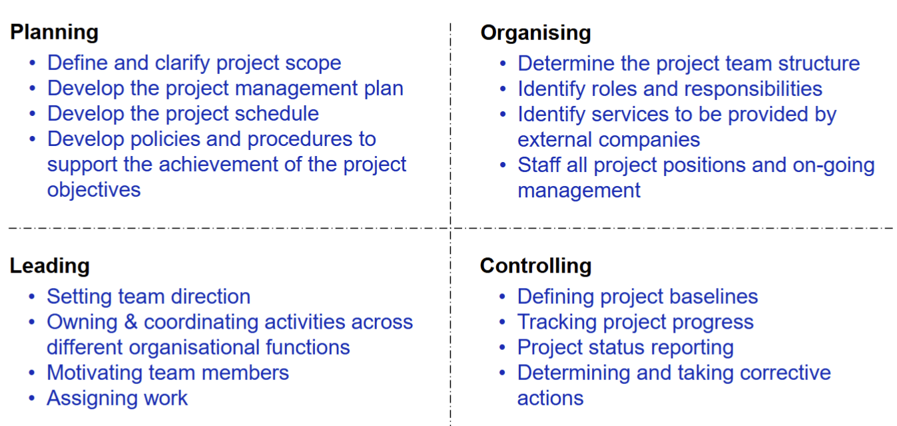
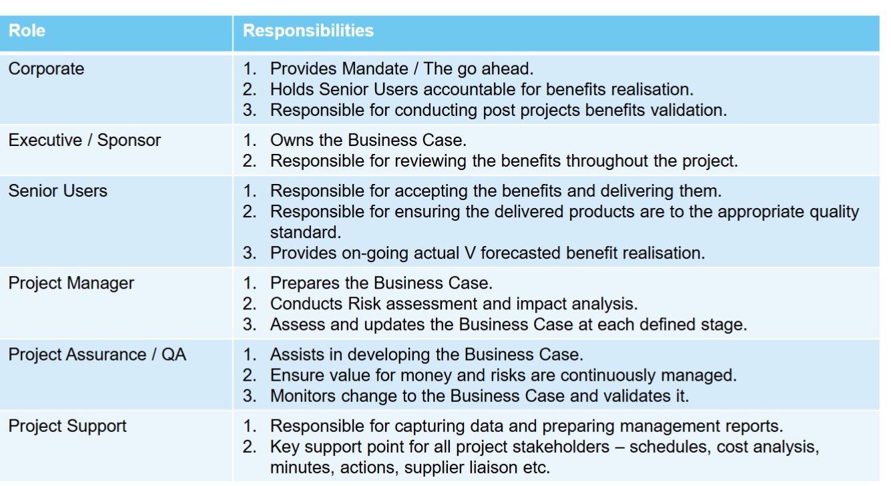
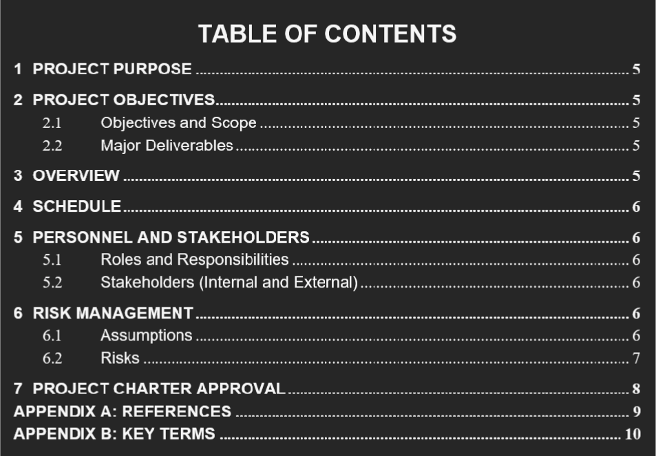

# Projects

## Importance of "Process"
- Process 
    - Systematic series of actions or steps taken to achieve a specific
goal. It involves planning, executing, monitoring, and controlling all aspects
of a project.
- Product 
    - The result or output of the process. For a software project, it
includes the software system and associated artefacts.

### Emphasized process
- Foundation for Success – A robust process critical for delivering successful projects
- Industry Relevance – Professionals rely and value sound processes in all aspects of the project development life cycle
- Skill Development – Focus on developing skills that are essential for managing and executing projects effectively.

## Project
- A temporary endeavour to create a unique product, service or outcome.

### Key characteristics:
- Introduce CHANGE to the organisation
- TEMPORARY, it has a defined beginning and end
- CROSS-FUNCTIONAL, cuts across organisational boundaries
- Deals with the UNKNOWN
- UNIQUE
- They all vary in SIZE

### Why projects
- Provides strategic alignment of key activities and visibility at the appropriate levels
- Mechanism to prioritise activities (Benefits, Regulatory, HW Refresh)
- Allows organisations to deliver change in a structured and formal manner outside of Business As
Usual
- Effective and efficient management of organisations limited resources (people & $’s)
- Establish ownership and accountability – Process and the Benefits
- Provide clarity, buy-in and agreement across what will be done, when, who, why and the
outcomes

## Project Management
- Project Management is the planning, delegating, monitoring and controlling of all aspects of a
project, and motivating those involved to achieve the project objectives within the expected targets
for time, costs, quality, scope, benefits and risks.
- Organising and structuring scarce resources
- Managing risk
- Identifying and clearing issues
- Managing and implementing change
- Retaining and re-using knowledge
- Organisational wide learning from past success and failures

- Maintain Balance in **Resource, Scope, and Time**

### Project Manager
- Tradition Project Manager Key Activities

- Agile
- No defined PM role
- Key activities are spread / shared across team members
    - Key project activities are still undertaken formally with appropriate documentation
- Some alignment between a Scrum Master and a Project Manager
- Move from Command and Control to Servant Leadership
    - Coaches and facilitates teams to deliver
    - Emphasises objectives
    - Is invested in the program's overall performance
    - Asks the teams for answers
    - Allows the teams to self-organise and hit their stride
    - Assists others with fixing issues

### How Projects success/fail
- Successful: project is completed on-time and on-budget, with all features and functions as initially specified.
- Challenged: completed and operational but over-budget, over the time estimate or offers fewer features and functions
than planned.
- Failed: project is cancelled at some point during the development cycle.

### Project Screening
- Approach to 
    - Select;
    - Prioritise;
    - Have oversight; and
    - Drive accountability across all projects
- Business Case: establish mechanisms to judge whether the project is (and remains) desirable, viable and achievable to support decision making in its initial and continued investment.
    - Provides a factual base for key decisions makers to decide if the project should be undertaken
    - Demonstrates how the project adds value to the organisation
    - Has a set of pre-defined standard organisational characteristics (costs, benefits, risk, etc.)
    - It is not all about size - size depends on the cost / benefit
    - It is a living document throughout the project that should be reviewed and signed off at key
    stages
- Business case contains:
    - Executive summary
    - Reasons / explanation of why it is required
    - Business options
    - Expected benefits
    - Expected dis-benefits
    - Timescale
    - Costs
    - Investment appraisal
    - Major risks

### Money!
- ROI is income divided by investment
    - $ROI = (total discounted benefits – total discounted costs) / total discounted
    costs$
    - High ROI means more profit

## Project Charter
