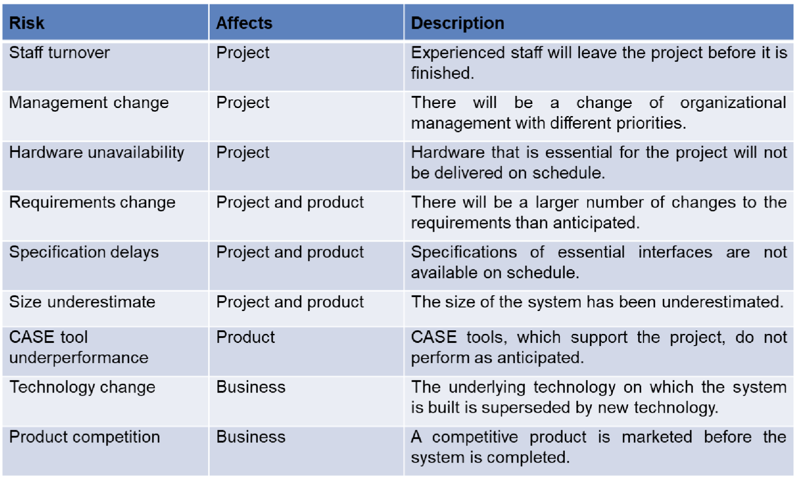
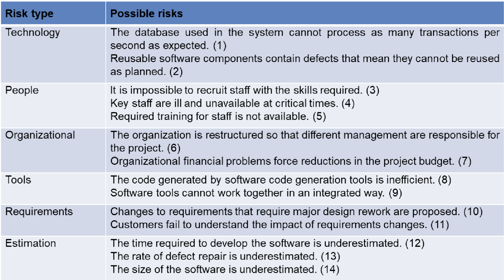
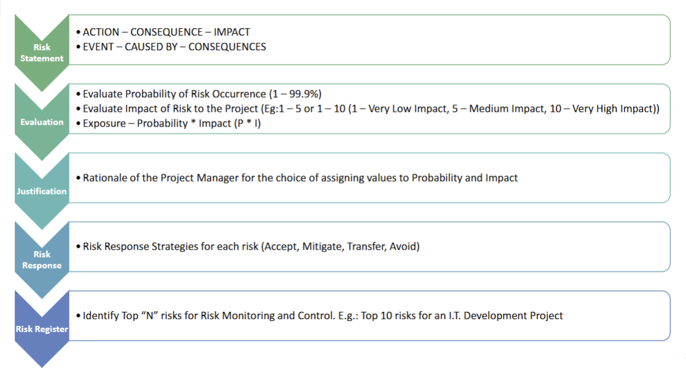
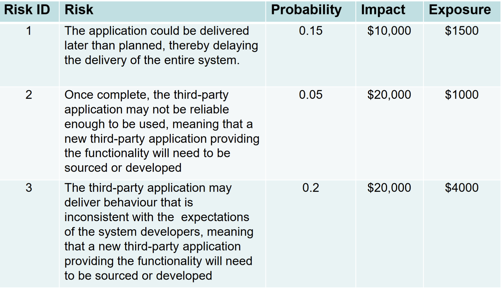
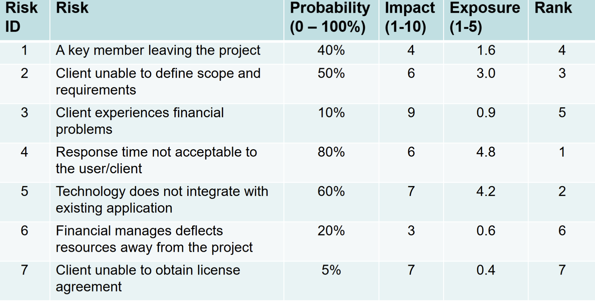
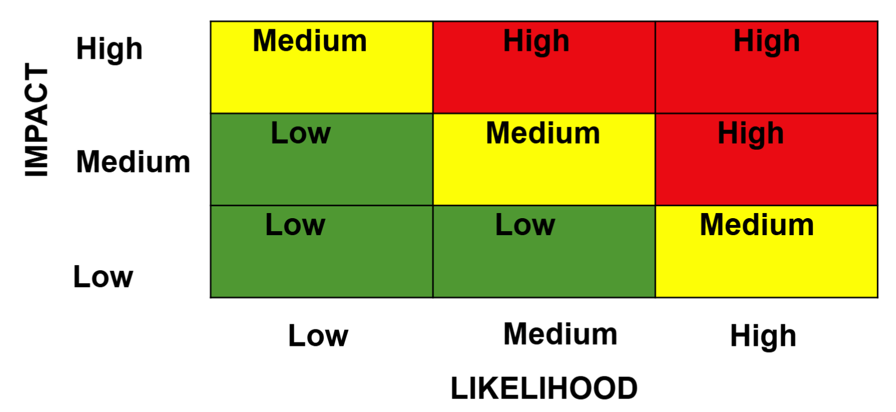
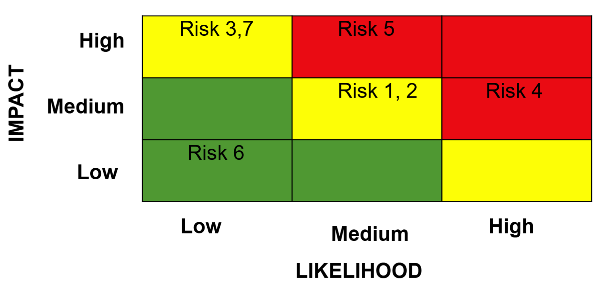
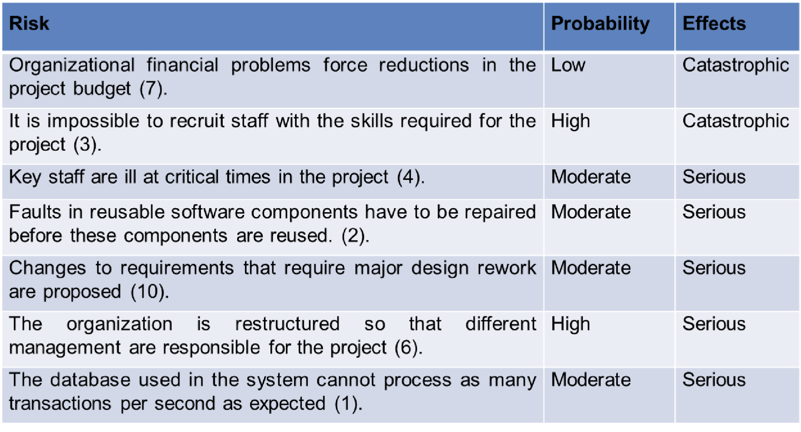
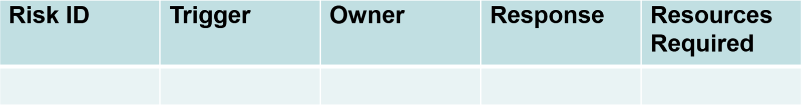
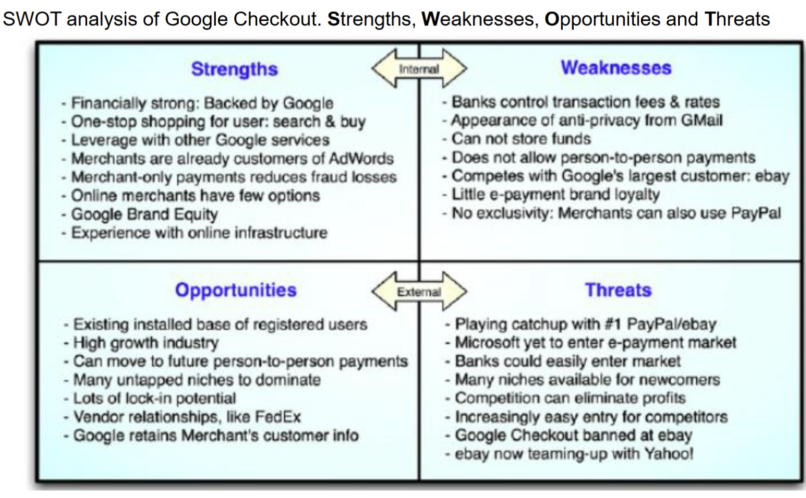

# Risk Management
- An uncertain event or condition that, if it occurs, has a positive or
negative effect on the project objectives - PMBOK

### Risk vs Uncertainty
- Uncertainty:
    - Lack of complete certainty about an event/outcome
    - The event/outcome has a probability of less than 1
    - E.g. outcome of a sporting event
- Risk:
    - Uncertainty that has an impact
    - E.g. If you have placed a bet on the sporting event, or have some other personal stake in it, then there is risk associated with the outcome of the sporting event
- Risk is a result of uncertainty but not every uncertainty is a risk

## Formal Risk Management

### Why Risk Management
- Projects have many possible risks, that could have        significant impacts on the outcomes:
    - Business risks
    - Project risks
    - Product risks
- A planned Risk Management process is essential for:
- minimising the impact of potential negative risks while maximising the impact of potential positive risks

## Risk Management Process
- Plan
    - How to approach and plan risk management activities?
- Identify
    - Identify the possible risks
- Analyse and Assess (Qualitative and Quantitative):
    - Identify the relative priorities of the identified risks
- Respond (Action):
    - How can we reduce the likelihood or impact of risks?
- Monitor and Control:
    - How can we detect the ongoing status of our risks? How can we control them effectively and efficiently?

### Plan
- output Risk Management Plan (RMP) that documents the procedures for managing risks throughout a project
- team should review the RMP and understand and implement the organisation’s and the sponsor’s approaches to risk management

## RISK
- What is the chance of event
- What is the impact of event on project
- Is there Degree of Control

- Generic Risk : Threats or opportunities common to every software project (e.g. staff turnover, budget and schedule pressures)
- Product-specific Risks:
- Threats or opportunities specific to the product, and can only be identified by people who have a clear understanding of the product and technology
- Project risks
    - Affect the planning of the project
- Product risks
    - Affect the quality or performance of the outcome being developed e.g. Design problems, implementation problems, interface problems, maintenance problems, verification problems
- Business risks
    - Affect the economic success of the project e.g. No demand for product, loss of management support, loss of external funding for the project etc

## Risk Management Process
- Risk identification
    - Identify project, product and business risks;
- Risk Analysis
    - Access Likelihood and consequences of these risks;
- Risk Planning
    - Draw up plans to avoid or minimize the effects of the risk;
- Risk Monitoring
    - Monitor the risks throughout the project.

### Risk Identification
- Pondering
    - This simply involves an individual taking the “pencil and paper” approach of risk identification, which involves sitting and thinking about the possible risks that could occur in the project.
- Interviews
    - Interviewing **project stake holders**, or asking them to fill out questionnaires, to harness their knowledge of a domain
- Brainstorms
    - The team can use a risk framework or the **Work Breakdown Structure (WBS)** to identify threats and opportunities
- Checklists
    - This involves the use of standard checklists of possible risk drivers that are collated from experience
    - These checklists are used as triggers for experts to think about the possible types of risks in that area
- Delphi Technique
    - A group of experts are asked to identify risks and their impact
    - The responses are them made available to each other anonymously
    - The experts are then asked to update their response based on the responses of others – repeated until consensus is reached
- SWOT Analysis (Case Study)
    - Strengths, Weaknesses, Opportunities and Threats
    - This technique allows finding strengths and weaknesses as well
#### SWOT Analysis
- Strengths: characteristics of the business or project that give it an advantage over others
- Weaknesses: characteristics that place the business or project at a disadvantage relative to others
- Opportunities: elements in the environment that the business or project could exploit to its advantage
- Threats: elements in the environment that could cause trouble for the business or project

## Risk Case Study - Bank of America Debit Card Fee
- Stakeholder: Bank of America
    - 2012 – Bank of America started charging its customers $5 per month to gain access to their funds using their debit cards
- RESULT
    - Thousands of customers dumped Bank of America and moved away to other banks and credit unions
    - A Risk Management Plan could have saved Bank of America bad press and the loss of business from lots of old-time customers
- TAKE AWAY
    - ‘Going full steam’ into a project – without little or no research on potential consequences as key project risks can turn projects into a disaster

### Risk Analysis and Assessment
- Risk analysis
    - Identify each identified risk’s probability and impact
- Risk assessment
    - Prioritize risks so that an effective risk strategy can be formulated
- Two approaches for analysis and assessment:
    - Qualitative: subjective assessment based on experience/intuition
    - Quantitative: mathematical and statistical techniques

#### Risk Assessment

#### Qualitative
- The important steps of risk analysis (**Qualitative**) are:
    1. Estimating the risk probability (P)
        - this is an estimation of the probability that the risk will occur
        - usually done based on expert judgement
    2. Estimating the risk impact (I)
        - the impact that the risk will have on the project
        - Usually measured in a scale of 1 – 5 (or 10):
            - no impact; (2) minimal impact; (3) moderate impact; (4) severe impact;
            and (5) catastrophic impact
        - Impact can be expressed as a monitory value
    3. Compute risk exposure (or P *I Score)
        - $Risk exposure= 𝑃∗ 𝐼$

    4. Identifying the root cause
        - It is important that one identifies the root causes of all risks
        - If this root cause can be identified, then all of these risks can be controlled
        by addressing the root cause

- Risk Matrix

#### Quantitative
- They are based on modelling a particular risk situation - probability distributions of risks are the main consideration
- Common Techniques:
    - Decision Tree Analysis
    - Simulation
    - Sensitivity Analysis

### Respond to Risk
- Four common strategies to handle **threats**:
    1. Accept or Ignore
    This means that we believe that the risk is of an acceptable exposure, that we hope that the event does not occur, or that the risk exposure is less than the cost of any techniques to avoid, mitigate, or transfer it.
    2. Avoid
    This means that we completely prevent the risky event from occurring, by either ensuring its probability is 0, or ensuring its impact 0.
    3. Mitigate
    This involves employing techniques to reduce the probability of the risk, or reduce
    the impact of the risk. This results in a residual risk — that is, a risk consisting of the same event, but with a lower probability/impact, and therefore low exposure. We then must analyse the residual risk as we would our primary risk.
    4. Transfer
    This involves transferring the burden of the risk to another party. Insurance is one example of risk transfer, in which the impact of the risk is offset by payments from the insurer. Another example is outsourcing a portion of the work to somebody with more knowledge and expertise, which comes at a cost.
- Four common strategies to handle **opportunities**:
    1. Exploit:
    Add work or change the project to make sure the opportunity occurs
    2. Enhance:
    Increase the probability and positive impact of risk events
    3. Share:
    Allocate ownership of opportunity to a third-party
    4. Accept:
    This means that we believe that the cost to exploit or enhance is not justifiable so do nothing about it.

### Monitor and Control Risk
- New threats and opportunities may arise in the course of the project – they must be identified, analysed and responded to
- Risk monitoring must be part of the overall monitoring and control of the project

- Tools for monitoring and controlling:
- Risk Audits:
    - external team looks at comprehensiveness of the identification process and ensuring other procedures and processes are in place
- Risk Reviews:
    - internal reviews of risks periodically that result in status reports generated for PM and those who need-to-know
- Risk status meetings:
    - risks must be reviewed and discussed in project status meetings, which are periodically held in projects (e.g. weekly meetings)

## Risk in Agile
- Plan
    - We do not plan and document everything in Agile but Risk Registers are documented.
- Identify
    - Risk assessment workshops conducted by Product Owner to identify areas
    - Risks are added as user stories and prioritized in Product Backlog
- Analyse and Assess (Qualitative and Quantitative):
    - Team members analyses/assess and plan these risks during sprint planning
    - They can add new risks as they discover
- Respond (Action):
    - Mitigation strategies defined for risk items and completed within sprint.
- Monitor and Control:
    - Product Owners receive regular updates on risk register
    - Scrum master monitors risks in daily stand ups

## Case Study - Google Checkout
**Google Checkout** was an
Online payment processing service provided by Google
Aimed at simplifying the process of paying for online purchases
Discontinued on November 20, 2013 and the service moved
to **Google Wallet** (now called **Google Pay**).
Users would store their **credit or debit card** and shipping
information in their Google account
Purchase at participating stores by clicking an on-screen button.
Google Checkout provided **fraud** protection and a unified page
for tracking purchases and their status.
