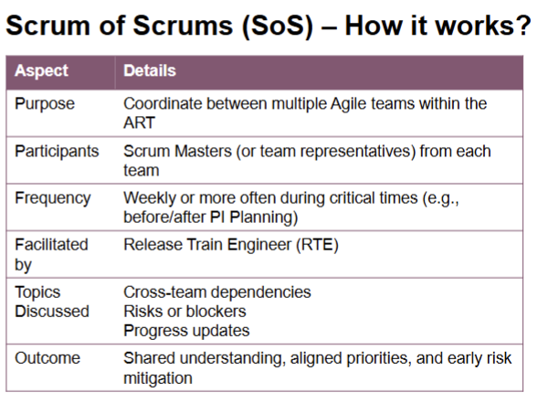
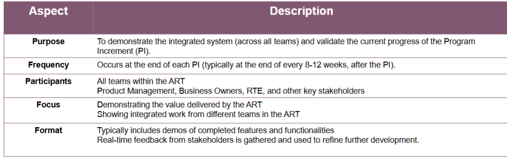
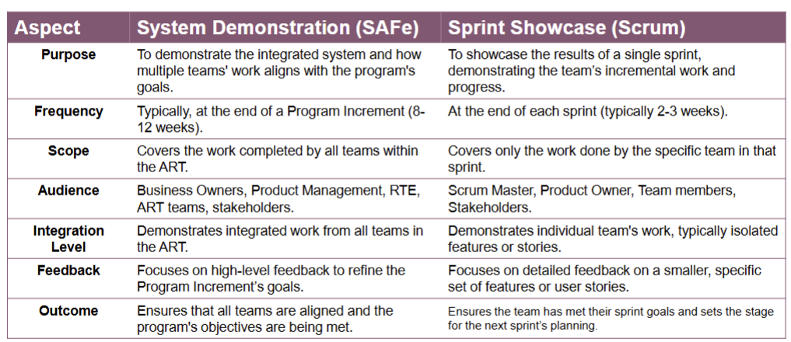
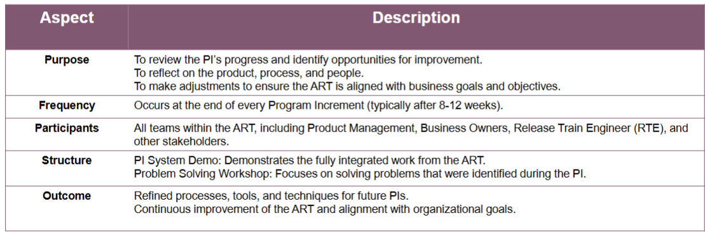
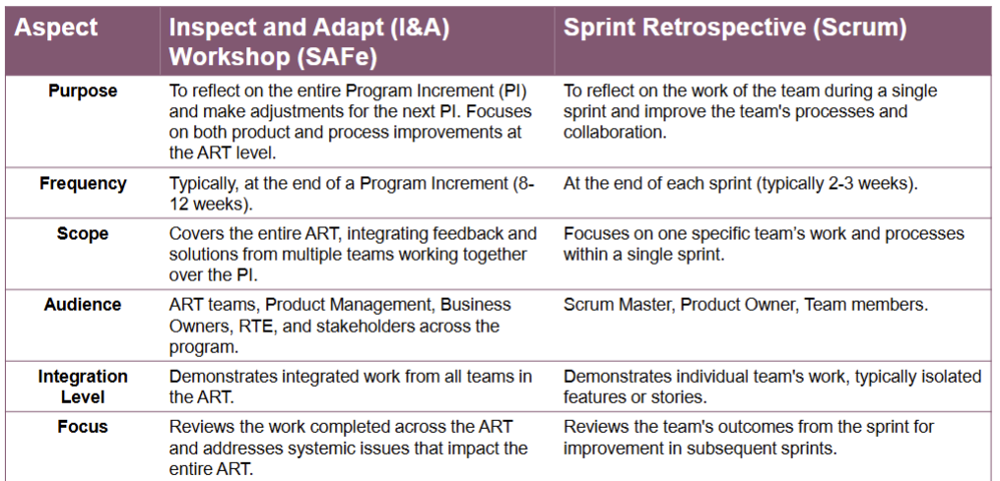

# Scrum at Scale - SAFe (Scaled Agile Framework)

- 
### Project Assumption: CareConnect+
- Background
    You are working on a government-funded initiative to develop a digital health platform that will serve patients, hospitals, doctors, and pharmacies.
- Integrated Modules:
   - Patient Portal: App for appointment booking, prescriptions, and health records
   - Hospital Dashboard: Real-time bed availability, emergency triage, and admin controls
   - Doctor Portal: Integration with Electronic Health Records (EHRs), consultation tools
   - Pharmacy System: Inventory management, drug availability tracking, and refill services
   - AI-Powered Insights: Predictive analytics for early diagnosis and resource planning
   - National API Gateway: Integration with third-party systems and health insurance providers
- Estimated Delivery Time: 18 – 24 Months in Phased Releases
- Potential Issues 
   - These are the kind of projects we do in the industry, right ?
   - Is this project even doable by a 5 – 10-member Scrum team? Nah !
   - How do we coordinate work across multiple teams working on different modules of this project?
   - Who ensures that the product vision stays aligned across all teams?
   - How are architectural decisions made and shared?
   - What if different teams have dependencies on each other’s outputs?
   - How do we plan and prioritize features at a program level, not just a team level?
   - Who resolves issues that are beyond the control of individual Scrum teams?
   - Can a single Product Owner handle all these requirements?
   - How do we ensure regular, integrated delivery when so many teams are involved?

## Essential SAFe
- helps scale Agile practices across **multiple teams** working on **large, complex products**.
- It brings together **Agile, Lean, and DevOps** principles.
- Essential SAFe focuses on the **Agile Release Train (ART)** – Virtual team of 5–12
Agile teams delivering value together.

- Key events
    - Program Increment (PI) Planning – Teams plan together every 8–12 weeks.
    - System Demo – integrated product demo from all teams at the end of each iteration.
    - Inspect & Adapt Workshop – Teams reflect and improve at the end of each PI
- Key Roles:
    - Release Train Engineer (RTE) – Like a “Super Scrum Master,” coordinating the ART.
    - Product Management – responsible for features and prioritization across the ART.
    - System Architect/Engineer – ensures technical alignment across teams.
    - Emphasizes alignment, collaboration, and synchronized delivery across teams
### Benefits

### Why Scrum is not enough at scale
- Scrum works great for a single cross-functional team (5-9)
- But as teams grow
    - Dependencies increase.
    - Alignment across teams becomes difficult.
    - Shared architecture and delivery timelines need coordination.
    - SAFe fills these gaps in scaling, while preserving Agile values.
 
## SAFe

### Roles and Responsibilities

- Agile Release Train (ART) – Roles
    - Release Train Engineer (RTE) acts as Chief Scrum Master for the train
    - Product Management owns, defines, and prioritizes the Program Backlog
    - System Architect provides architectural guidance and technical enablement to the teams on the train
    - Business Owners are key Stakeholders on the train to ensure the value delivered by the ART meets customer and organizational needs
- Team Roles
    - Scrum Master facilitates team Scrum events, removes blockers, and supports Agile practices within the team
    - Product Owner owns the Team Backlog. Defines and prioritizes User Stories. Aligns with Product Management.
    - Agile Team delivers working software every iteration. Breaks down Features into Stories and estimates effort.
### Key area iof Essential SAFe
- **Product Increment (PI) Planning**  
  A collaborative event where all teams in the Agile Release Train (ART) work together on a shared plan.

- **Agile Release Train (ART)**  
  A team of Agile Teams (50–125 people) working together to deliver value in a synchronized manner.

- **SAFe Roles and Responsibilities**  
  Key roles include Release Train Engineer (RTE), Product Management, System Architect, Scrum Master, and Product Owner.

- **Dependency Management (Scrum of Scrums)**  
  A mechanism to coordinate work and resolve dependencies across multiple teams.

- **Program Backlog**  
  Contains prioritized features that guide the work of the ART during a Program Increment (PI).

- **System Demonstration**  
  A regular event where teams demonstrate the integrated work completed during the iteration to stakeholders.

- **Inspect and Adapt (I&A) Workshop**  
  A structured event at the end of the PI to review progress, identify improvements, and plan for the next increment.

#### Product Increment (PI) Planning 
- PI Planning is a regular, timeboxed event
    - (usually every 8–12 weeks; 10 weeks is common).
- All teams in the Agile Release Train (ART) plan together—preferably in person.
- Product Management decides the priority of features.
- Agile Teams break features into stories and estimate the effort.
- System Architects/Engineers guide technology decisions and help manage dependencies
- Program Level Calendar
    - PI Planning Sessions
    - System Demos
    - Inspect & Adapt Workshops
- Team Level Activities
    - Iteration Planning
    - Iteration Reviews
    - Iteration Retrospectives
- Features
    - A Feature is a service or capability valuable to the user.
    - Includes a Benefit Hypothesis (why it’s worth doing) and Acceptance Criteria (what makes it done).
    - Product Management defines and prioritizes features.
    - Features include both functional and non-functional needs.
    - A feature should be delivered within a single Program Increment.
- Scenario Assumption
    - Feature : Personalized Course Dashboard
    - Benefit Hypothesis: Providing students with a personalized dashboard will improve course engagement and reduce confusion about deadlines and resources, leading to better academic performance
    - Acceptance Criteria
        - Students to be able to see list of enrolled courses
        - Upcoming Assignment Deadlines highlighted per course
        - Dashboard loads under 3 seconds both for web and mobile interfaces
        - Customization support with widgets that students can choose

#### Agile Release Train 
- Virtual Organization of about 5 – 12 teams (about 50 – 125 individuals) that plans, commits, and executes together
- Program Increment (PI) is a fixed timebox. Default is 10 weeks
- Typically consists of 4 – 5 Iterations
- Synchronized Iterations and PI's
- All teams work on the same cadence to ensure alignment / coordination
- Aligned to a common mission via a single Program Backlog
- Operates under architectural and UX guidance from System Architect
- Frequently produces valuable and evaluable System Level Solutions, demonstrated during the System Demo
- Identifies and manages Dependencies between teams for smooth delivery of value
- Facilitated by the Release Train Engineer (RTE), who ensures alignment across teams

#### Dependency Management
- Managing Dependencies across teams
- In large programs, multiple Agile teams work together toward a common goal.
- Teams often depend on each other to complete features or share components.
- Unmanaged dependencies lead to delays, rework, or integration issues.
- SAFe uses structured events like Scrum of Scrums (SoS) to coordinate across teams.

#### Program Backlog
- The Program Backlog is the single source of truth for upcoming work at the Agile Release Train level.
- It contains Features (not individual User Stories) prioritized by Product Management.
- Features represent larger functionalities valuable to users or customers.
- Each Feature includes:
    - Benefit Hypothesis – why the Feature is worth building
    - Acceptance Criteria – how to know it's done
- Owned by Product Management
- Typically spans across multiple Program Increments

- Why is it important?
    - Aligns all teams on the Agile Release Train (ART) with a common set of priorities.
    - Drives PI Planning – Teams select Features from this backlog for implementation in the next Program Increment.
- What happens to Features?
    - Broken down into User Stories during PI Planning.
    - Stories are distributed across teams based on capacity, expertise, and dependencies.
- Helps to answer:
    - What should we build next?
    - What features delivers the most value to customers?

#### System Demonstration
- All the teams in an Agile Release Train (ART) come together to demonstrate the
integrated work they have completed during the Program Increment (PI).
- This event shows how the features delivered by all the teams are integrated into a
working solution.

#### Inspect and Adapt (I&A) workshop
- Key event in SAFe held at the end of each Program Increment (PI).
- Provides an opportunity for the entire Agile Release Train (ART) to reflect on the PI’s progress, identify areas for improvement, and adjust their approach going forward.

## Summary
## 🧩 Core Concepts

- **ART (Agile Release Train)**  
  A team of Agile teams (typically 5–12) that delivers value together in a synchronized cadence.

- **PI (Program Increment)**  
  A timebox (usually 8–12 weeks) during which an ART delivers incremental value in the form of working, tested software and systems.

- **PI Planning**  
  A two-day cadence-based event where all ART teams align on a shared vision and commit to delivery goals.

- **Product Management**  
  Defines and prioritizes Features in the Program Backlog; works with teams during PI Planning.

- **Feature**  
  A service or capability that fulfills a stakeholder need; fits within a PI and is decomposed into Stories.

- **User Story**  
  A small, testable unit of work that fits into one Iteration (Sprint); delivers part of a Feature.

- **System Demo**  
  An integrated demonstration of new functionality from all teams at the end of each iteration or PI.

- **Program Backlog**  
  A prioritized list of Features intended to be implemented by the ART over upcoming PIs.

- **Scrum of Scrums**  
  A coordination meeting where team representatives (often Scrum Masters) discuss cross-team issues.

- **Inspect & Adapt (I&A)**  
  A workshop held at the end of each PI to reflect, measure outcomes, and drive continuous improvement.

## 👥 SAFe Roles

- **Release Train Engineer (RTE)**  
  Facilitates ART events, removes cross-team impediments, supports coordination and delivery.

- **Product Management**  
  Owns and prioritizes the Program Backlog; defines and prioritizes Features across teams.

- **Product Owner (PO)**  
  Works with one Agile team; owns the Team Backlog and defines User Stories.

- **System Architect / Engineer**  
  Provides architectural guidance and helps teams align with enterprise standards.

- **Business Owners**  
  Key stakeholders who have authority and accountability for business outcomes of the ART.

- **Scrum Master**  
  Supports a specific team; facilitates team-level ceremonies and removes local blockers.

- **Agile Team Member**  
  Developers, testers, designers, etc., who collaborate to build and deliver Stories and Features.